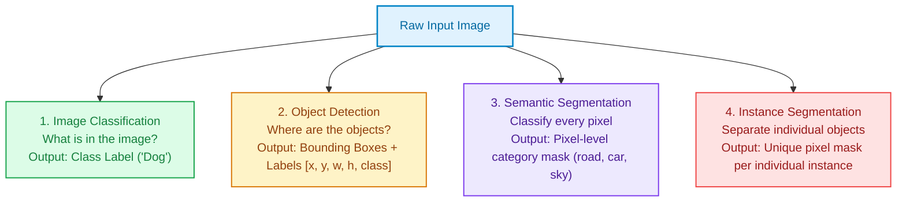
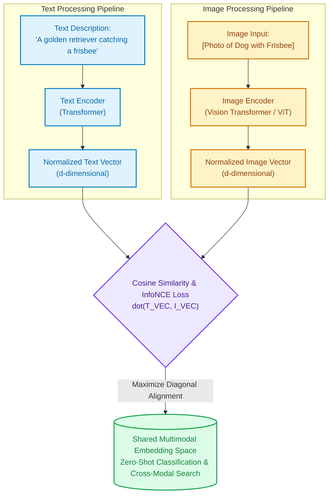

# Module 05: Natural Language Processing (NLP) & Computer Vision

This module covers the core concepts, classical foundations, deep learning architectures, and modern multi-modal systems for **Natural Language Processing (NLP)** and **Computer Vision (CV)**. Freshers are expected to understand both the statistical feature engineering methods and the modern transfer learning and vision-language models.

---

## Section 1: Classical NLP Foundations

### Q1: What is NLP, and what are the standard text preprocessing steps?
**Answer:**
Natural Language Processing (NLP) is the discipline of computational linguistics and machine learning that enables software to analyze, understand, and generate human language.

**Standard Text Preprocessing Pipeline:**
1. **Lowercasing & Normalization:** Standardizing `"Apple"` and `"apple"` to ensure identical token indices.
2. **Noise Removal:** Stripping HTML tags, markdown formatting, emojis, and punctuation via regex.
3. **Tokenization:** Splitting continuous string sequences into discrete units (words, subwords, or characters).
4. **Stopword Removal:** Eliminating high-frequency, low-information words (`"the"`, `"is"`, `"at"`, `"which"`). *Note:* In modern transformer models, stopwords are preserved because self-attention requires complete syntactic structure.
5. **Stemming vs. Lemmatization:**
   - **Stemming:** A crude rule-based heuristic that chops off word suffixes (e.g., Porter Stemmer: `"studies"` → `"studi"`, `"caring"` → `"car"`). Fast but often produces non-words.
   - **Lemmatization:** A vocabulary- and morphological analysis-driven process that maps words back to their dictionary base form or lemma (e.g., WordNet: `"better"` → `"good"`, `"running"` → `"run"`). Accurate but computationally heavier.

---

### Q2: What is the Bag-of-Words (BoW) model, and what are its limitations?
**Answer:**
The **Bag-of-Words (BoW)** model is a simple vectorization technique that represents text as a fixed-length vector of word frequencies, discarding grammar, sentence structure, and word order.

```python
from sklearn.feature_extraction.text import CountVectorizer

corpus = [
    "Machine learning is fascinating.",
    "Deep learning is a subset of machine learning."
]

vectorizer = CountVectorizer()
X = vectorizer.fit_transform(corpus)

print("Vocabulary:", vectorizer.get_feature_names_out())
print("BoW Vectors:\n", X.toarray())
```

**Limitations of BoW:**
- **Sparse Representation:** Large vocabularies ($V = 50,000+$) yield extremely sparse vectors where 99.9% of entries are zero.
- **Out-of-Vocabulary (OOV) Fragility:** Cannot encode unseen words at test time.
- **Zero Semantic Meaning:** The vectors for `"automobile"` and `"car"` are completely orthogonal ($d_{\cos} = 0$).
- **Loss of Sequential Context:** `"Not bad, very good"` and `"Not good, very bad"` produce identical BoW representations despite opposite meanings.

---

### Q3: How does TF-IDF improve upon Bag-of-Words?
**Answer:**
**TF-IDF (Term Frequency-Inverse Document Frequency)** penalizes ubiquitous words that appear across all documents (e.g., `"document"`, `"system"`) while boosting words that carry high discriminative power for a specific text:

$$\text{TF-IDF}(t, d, D) = \text{TF}(t, d) \times \text{IDF}(t, D)$$

1. **Term Frequency (TF):** Relative frequency of term $t$ in document $d$:
   $$\text{TF}(t, d) = \frac{\text{Count of } t \text{ in } d}{\text{Total words in } d}$$
2. **Inverse Document Frequency (IDF):** Measure of how rare term $t$ is across the entire corpus $D$:
   $$\text{IDF}(t, D) = \log\left(\frac{N}{|\{d \in D : t \in d\}|}\right)$$

```python
from sklearn.feature_extraction.text import TfidfVectorizer

corpus = [
    "Artificial intelligence drives autonomous driving cars.",
    "Stock market volatility affects investor intelligence.",
    "Autonomous cars use deep learning algorithms."
]

tfidf = TfidfVectorizer()
X_tfidf = tfidf.fit_transform(corpus)
print("TF-IDF Shape:", X_tfidf.shape)
```

---

### Q4: What are Sentiment Analysis and Named Entity Recognition (NER)?
**Answer:**
- **Sentiment Analysis:** Sequence classification mapping input text into sentiment polarities (Positive, Negative, Neutral) or fine-grained emotional categories.
- **Named Entity Recognition (NER):** A token-level classification task (using BIO tagging: Beginning, Inside, Outside) identifying real-world entities:

```
"Satya Nadella, CEO of Microsoft, visited Zurich in 2026."
 [B-PER] [I-PER]   O   [B-ORG]       O    [B-LOC]  [B-DATE]
```

```python
from transformers import pipeline

# Zero-setup HuggingFace pipelines
ner_pipe = pipeline("ner", grouped_entities=True)
entities = ner_pipe("Satya Nadella, CEO of Microsoft, visited Zurich.")
for ent in entities:
    print(f"{ent['word']} -> {ent['entity_group']} ({ent['score']:.2f})")
```

---

## Section 2: Word & Sentence Embeddings

### Q5: What is Word2Vec, and how do CBOW and Skip-gram differ?
**Answer:**
**Word2Vec (Mikolov et al., 2013)** introduced dense, continuous low-dimensional vector spaces ($D \approx 100\text{--}300$) where semantically related words are located physically close together, demonstrating linear algebraic properties:

$$\vec{v}_{\text{King}} - \vec{v}_{\text{Man}} + \vec{v}_{\text{Woman}} \approx \vec{v}_{\text{Queen}}$$

| Property | Continuous Bag of Words (CBOW) | Continuous Skip-gram |
|---|---|---|
| **Objective** | Predict the **target word** given context words. | Predict **context words** given a single target word. |
| **Input $\to$ Output** | $w_{t-2}, w_{t-1}, w_{t+1}, w_{t+2} \to w_t$ | $w_t \to w_{t-2}, w_{t-1}, w_{t+1}, w_{t+2}$ |
| **Training Speed** | Fast ($k$ times faster), efficient on large datasets. | Slower to train due to multiple context predictions. |
| **Data Efficiency** | Better for frequent words; smooths over representations. | Superior performance on **infrequent, rare words**. |

---

### Q6: Why did static embeddings (Word2Vec, GloVe) get replaced by Contextual Embeddings?
**Answer:**
Static embeddings assign a **single, fixed vector** to each word in the vocabulary, regardless of the sentence context:
- In Word2Vec, the word `"bank"` has one unchanging vector representation.
- In reality, `"river bank"` and `"investment bank"` have totally different semantic meanings (polysemy).
- **Contextual Embeddings (BERT, RoBERTa):** The embedding of a token is computed dynamically via bidirectional Multi-Head Self-Attention over all surrounding tokens in the sentence. `"bank"` in a financial document receives an embedding completely distinct from `"bank"` in a geographic document.

---

## Section 3: Computer Vision & Convolutional Neural Networks (CNNs)

### Q7: How do computers represent images, and why do Standard Dense Networks fail on image data?
**Answer:**
A digital color image is stored as a 3D NumPy tensor of shape $(\text{Height}, \text{Width}, \text{Channels})$, where each pixel channel holds an integer from $0$ to $255$ (Red, Green, Blue).

**Why Fully Connected (Dense) Layers Fail for Vision:**
1. **Parameter Explosion:** A modest $1000 \times 1000 \times 3$ image flattened into a dense layer with $1000$ hidden units creates $3,000,000 \times 1,000 = 3\text{ Billion}$ weights for a single layer, causing instant Out-Of-Memory (OOM) and massive overfitting.
2. **Loss of Spatial Topology:** Flattening a 2D image into a 1D vector strips adjacent spatial correlations (pixels close to each other horizontally and vertically belong to the same object).
3. **Lack of Translation Invariance:** If a cat appears in the top-left corner versus bottom-right, a dense network treats them as completely distinct feature weights.

---

### Q8: What are the fundamental layers of a CNN?
**Answer:**
CNNs resolve the parameter explosion through **Local Receptive Fields**, **Weight Sharing**, and **Spatial Subsampling**:

```mermaid
flowchart LR
    IN["Input Image<br/>(224x224x3 RGB)"] --> CONV1["Conv Layer 1<br/>(Edges & Gradients)"]
    CONV1 --> POOL1["MaxPooling 1<br/>(Spatial Downsampling)"]
    POOL1 --> CONV2["Conv Layer 2<br/>(Textures & Patterns)"]
    CONV2 --> POOL2["MaxPooling 2<br/>(High-Level Features)"]
    POOL2 --> FC["Dense / Flatten Layer<br/>(Feature Vector)"]
    FC --> OUT(["Softmax Output<br/>(Class Probabilities)"])

    classDef input fill:#E0F2FE,stroke:#0284C7,stroke-width:2px,color:#0369A1;
    classDef conv fill:#EDE9FE,stroke:#7C3AED,stroke-width:1.5px,color:#4C1D95;
    classDef pool fill:#FEF3C7,stroke:#D97706,stroke-width:1.5px,color:#92400E;
    classDef dense fill:#F1F5F9,stroke:#64748B,stroke-width:1.5px,color:#334155;
    classDef out fill:#DCFCE7,stroke:#16A34A,stroke-width:2px,color:#15803D;

    class IN input;
    class CONV1,CONV2 conv;
    class POOL1,POOL2 pool;
    class FC dense;
    class OUT out;
```



1. **Convolutional Layer:** Applies $K$ learnable filters (kernels, e.g., $3 \times 3$) that slide across the input tensor computing dot products.
   - **Stride ($S$):** The step size of kernel shifts across pixels.
   - **Padding ($P$):** Adding zero-value borders around the image. With `"same"` padding, output spatial dimensions equal input dimensions:
     $$W_{\text{out}} = \left\lfloor \frac{W_{\text{in}} - K + 2P}{S} \right\rfloor + 1$$
2. **Activation (ReLU):** Introduces non-linearity $f(x) = \max(0, x)$ to model complex boundaries.
3. **Pooling Layer (MaxPooling / AvgPooling):** Downsamples spatial resolution (e.g., $2 \times 2$ pool with stride 2 cuts height and width in half), reducing parameter count and conferring translation tolerance.
4. **Fully Connected / Global Average Pooling (GAP):** Condenses 2D spatial feature maps into a 1D vector passed to the output classification layer.

---

### Q9: Why was ResNet (Residual Networks) revolutionary, and what is a Residual Skip Connection?
**Answer:**
Before ResNet (He et al., 2015), stacking more layers caused **degradation**: as depth exceeded 20 layers, training error actually *worsened* because vanishing and exploding gradients prevented backpropagation signals from reaching early layers.

**The Residual Block Innovation:**
Instead of forcing layers to fit an underlying mapping $\mathcal{H}(x)$, ResNet forces them to fit a **residual mapping** $\mathcal{F}(x) = \mathcal{H}(x) - x$:

$$\mathcal{H}(x) = \mathcal{F}(x) + x$$

```
   Input x ────────┐ (Identity Shortcut / Skip Connection)
      │            │
   [Weight Layer]  │
      │            │
   [ReLU]          │
      │            │
   [Weight Layer]  │
      │            │
      ▼            ▼
   Addition: F(x) + x
      │
   [ReLU]
      │
    Output
```

**Why It Solves Vanishing Gradients:**
During backpropagation, the gradient with respect to input $x$ is:

$$\frac{\partial \mathcal{H}}{\partial x} = \frac{\partial \mathcal{F}}{\partial x} + 1$$

The **$+1$ term** acts as an uninterrupted gradient superhighway: even if the weights' gradient $\frac{\partial \mathcal{F}}{\partial x}$ approaches zero, the gradient signal flows back unimpeded through the identity path $+1$. This enabled training networks with **152+ layers**.

---

### Q10: How do you implement PyTorch Transfer Learning with frozen backbones?
**Answer:**
```python
import torch
import torch.nn as nn
from torchvision import models

# 1. Load pre-trained ResNet-50 trained on ImageNet (1.4M images, 1000 classes)
model = models.resnet50(weights=models.ResNet50_Weights.DEFAULT)

# 2. Freeze all convolutional backbone weights (disable backprop updates)
for param in model.parameters():
    param.requires_grad = False

# 3. Replace the final fully connected classification head for your custom task (e.g., 2 classes: Cat vs Dog)
in_features = model.fc.in_features
model.fc = nn.Sequential(
    nn.Linear(in_features, 256),
    nn.ReLU(),
    nn.Dropout(p=0.3),
    nn.Linear(256, 2)  # Binary output logits
)

# 4. Only parameters of model.fc have requires_grad=True and will be trained
optimizer = torch.optim.Adam(model.fc.parameters(), lr=1e-3)
criterion = nn.CrossEntropyLoss()

print(f"Trainable parameters: {sum(p.numel() for p in model.fc.parameters())}")
```

---

## Section 4: Vision Tasks Hierarchy: Classification, Detection & Segmentation

### Q11: What is the technical difference between Classification, Object Detection, and Segmentation?
**Answer:**



| Dimension | Image Classification | Object Detection | Semantic Segmentation | Instance Segmentation |
|---|---|---|---|---|
| **Goal** | Assign single global label. | Localize multiple objects. | Label every pixel by class. | Label every pixel + identify instances. |
| **Output** | Single class ID + score. | Bounding boxes $[x, y, w, h] + \text{class}$. | Mask where pixels = class ID. | Mask where pixels = unique instance ID. |
| **Key Metric** | Accuracy, Top-5 Error. | mAP (mean Average Precision @ IoU). | mIoU (mean Intersection over Union). | Mask AP. |
| **SOTA Models** | ConvNeXt, ViT, EfficientNet. | YOLOv8 / YOLOv11, RT-DETR. | DeepLabV3+, SegFormer, UNet. | Mask R-CNN, Segment Anything (SAM). |

---

### Q12: How does Intersection over Union (IoU) evaluate Object Detection bounding boxes?
**Answer:**
**Intersection over Union (IoU)**, also called the Jaccard Index, measures the spatial overlap between the model's predicted bounding box ($B_p$) and the human ground-truth box ($B_{gt}$):

$$\text{IoU} = \frac{\text{Area of Overlap}(B_p \cap B_{gt})}{\text{Area of Union}(B_p \cup B_{gt})}$$

- **$\text{IoU} = 1.0$:** Perfect overlap.
- **$\text{IoU} \ge 0.5$:** Standard benchmark threshold to classify a prediction as a **True Positive (TP)**.
- **$\text{IoU} < 0.5$:** Classified as a **False Positive (FP)**.

---

## Section 5: Multimodal Alignment: Vision-Language & Audio

### Q13: How does CLIP (Contrastive Language-Image Pre-training) align text and images in a shared space?
**Answer:**
Introduced by Radford et al. (OpenAI, 2021), **CLIP** revolutionized multimodal AI by training an Image Encoder (ViT or ResNet) and a Text Encoder (Transformer) simultaneously on 400 million $(image, text)$ pairs scraped from the web.



**The Contrastive Objective (InfoNCE):**
Given a batch of $N$ image-text pairs:
1. Compute the $N \times N$ matrix of cosine similarities between all $N$ image embeddings and all $N$ text embeddings.
2. Maximize the cosine similarity of the $N$ correct diagonal pairs $(I_i, T_i)$.
3. Minimize the cosine similarity of the $N^2 - N$ incorrect off-diagonal pairs $(I_i, T_j \text{ where } i \ne j)$.

**Zero-Shot Classification via CLIP:**
Instead of training a custom classifier, you pass an image into the image encoder and pass candidate prompt templates (e.g., `"a photo of a {dog}"`, `"a photo of a {cat}"`) into the text encoder. The class with the highest cosine similarity is the predicted label!

---

### Q14: How are Vision Transformers (ViT) different from CNNs?
**Answer:**
Vision Transformers (Dosovitskiy et al., 2020) apply standard Transformer encoders directly to images without using convolutional filters:
1. **Patch Extraction:** Split an image (e.g., $224 \times 224$) into non-overlapping $16 \times 16$ pixel patches.
2. **Linear Projection:** Flatten each patch into a vector and project to dimension $D$ (analogous to word token embeddings).
3. **Position Embeddings:** Add 1D learnable position embeddings so self-attention understands spatial locations.
4. **Trade-offs vs. CNNs:**
   - **Inductive Bias:** CNNs have built-in inductive biases (**locality** and **translation equivariance**). ViTs have *no* locality bias and must learn spatial relationships entirely from data.
   - **Data Appetite:** ViT underperforms CNNs on small datasets (<100k images), but vastly outperforms CNNs when pre-trained on massive datasets (JFT-300M, LAION-5B) because self-attention has global receptive fields from layer 1.

---

## Key Takeaways for Interviews
- **TF-IDF** balances term frequency against corpus rarity, providing a baseline lexical weighting technique.
- **Skip-connections in ResNet** solve vanishing gradients by adding identity shortcuts ($\mathcal{F}(x) + x$), enabling deep model convergence.
- **IoU** measures bounding box overlap, while **mAP** evaluates object detectors across confidence thresholds.
- **CLIP** aligns visual and textual modalities into a single shared hypersphere, powering modern zero-shot search and multimodal GenAI.

---

[← Previous: Module 04 - Deep Learning Fundamentals](./04_deep_learning_fundamentals.md) | [Next: Module 06 - Generative AI, LLMs & Advanced RAG →](./06_genai_llms_and_rag.md)