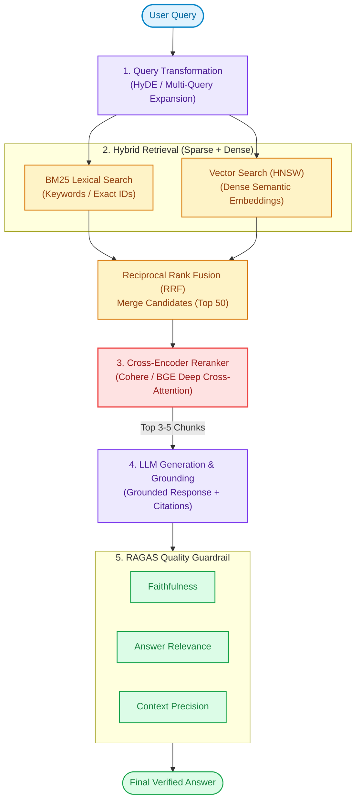

# Module 06: Generative AI, LLMs & RAG — Fresher Edition

This is the most exciting and in-demand area in AI today. Every fresher interviewing for an AI/ML role is now expected to know the basics of Generative AI, LLMs, Transformers, Prompting, and RAG.

---

## 1. Generative AI

### Q1: What is Generative AI?
**Answer:**
Generative AI is a type of AI that can **create new content** — text, images, audio, code, or video — that did not exist before. It learns patterns from massive amounts of existing data and uses that knowledge to generate something new.

**Examples of Generative AI in daily use:**
- **ChatGPT** → Generates human-like text conversations
- **DALL-E / Midjourney** → Generates images from text descriptions
- **GitHub Copilot** → Generates code suggestions
- **Suno / Udio** → Generates music
- **Synthesia** → Generates AI avatar videos

**Contrast with Traditional AI:**
- Traditional/Discriminative AI: *"Is this email spam or not?"* → Classifies existing data.
- Generative AI: *"Write me a professional email declining this job offer."* → Creates new content.

### Q2: What is the difference between Discriminative AI and Generative AI?
**Answer:**

| | Discriminative AI | Generative AI |
|---|---|---|
| **Task** | Classifies or predicts from existing data | Creates new data |
| **Question it answers** | "What category does this belong to?" | "What would new data in this domain look like?" |
| **Examples** | Spam detector, Face recognizer, Credit scoring | ChatGPT, DALL-E, Copilot, Gemini |
| **Output** | A label, number, or probability | New text, image, audio, or code |

---

## 2. Large Language Models (LLMs)

### Q3: What is an LLM (Large Language Model)?
**Answer:**
A **Large Language Model (LLM)** is a type of AI model trained on enormous amounts of text data (books, websites, code, research papers — hundreds of billions of words) to understand and generate human language.

**The word "Large" refers to:**
1. **Massive training data** (trillions of tokens from the internet)
2. **Billions of parameters** (learned weights — GPT-4 has ~1.8 trillion)
3. **Huge compute required** (thousands of GPUs running for weeks/months)

**Popular LLMs:**
| Model | Company | Open / Closed |
|---|---|---|
| GPT-4 / GPT-4o | OpenAI | Closed (API access) |
| Gemini 1.5 Pro | Google DeepMind | Closed (API access) |
| Claude 3.5 | Anthropic | Closed (API access) |
| LLaMA 3 | Meta AI | Open Source |
| Mistral / Mixtral | Mistral AI | Open Source |

### Q4: What are Parameters in an LLM? Why do we say "70B model"?
**Answer:**
**Parameters** are the learnable numerical values (weights) inside a neural network. More parameters generally means a more capable model that can learn more complex patterns.

- "70B model" means a model with **70 Billion parameters**.
- Each parameter is a single number (float). A 70B model in 32-bit precision requires **280 GB of VRAM** just to load!

---

## 3. Tokens & Context Window

### Q5: What is a Token in the context of LLMs?
**Answer:**
In LLMs, a **token** is the basic unit of text that the model reads and generates. Think of tokens as chunks of text — roughly 3-4 characters each, or about ¾ of a word on average.

```
Sentence: "Artificial intelligence is transforming every industry."

Tokens:  ["Art", "ificial", " intelligence", " is", " transform", "ing", " every", " industry", "."]
Count:   9 tokens (approximately)
```

**Why does it matter?**
- LLMs have a **context window** (maximum token limit they can read at once).
- **You pay for API calls by tokens** (both input + output tokens count).

### Q6: If a Token is for Text — What is the Equivalent for Images, Video, and Audio?
**Answer:**
Modern multimodal AI models process all kinds of data by breaking them down into processable units:
- **Images → Patches (Visual Tokens):** Split into small fixed-size squares (e.g., 16x16 pixels).
- **Video → Frame Patches (Video Tokens):** Sampled frames are split into patches over time.
- **Audio → Mel Spectrogram Frames (Audio Tokens):** Audio is converted to a visual frequency map and chunked.

### Q7: What is Context Window? Why does it matter?
**Answer:**
The **Context Window** is the maximum amount of text (measured in tokens) that an LLM can process in a single request — both your input (prompt) AND the model's output combined.

```
Context Window Examples:
 GPT-3.5-Turbo:  4,096 tokens (~3,000 words)
 GPT-4o:     128,000 tokens (~96,000 words)
 Gemini 1.5 Pro: 1,000,000 tokens (~750,000 words)!
```

---

## 4. The Transformer Architecture

### Q8: What is the Transformer Architecture?
**Answer:**
The **Transformer** is the underlying neural network architecture introduced by Google in 2017 (in the paper *"Attention Is All You Need"*) that powers all modern LLMs.

**Why it changed AI:**
Prior to Transformers, models (like RNNs/LSTMs) processed text sequentially (word by word), which was slow and struggled with long sentences.
Transformers process **entire sequences at once (in parallel)** and use a mechanism called **Self-Attention** to understand context, making them incredibly fast and highly scalable.

---

## 5. Attention (Self-Attention)

### Q9: What is Self-Attention?
**Answer:**
**Self-Attention** is the core mechanism of the Transformer. It allows the model to look at all the words in a sentence simultaneously and figure out which words are related to each other, regardless of how far apart they are.

**Example:**
*"The **bank** of the river was muddy."* vs. *"I deposited money in the **bank**."*

Through self-attention, the model assigns high "attention weights" between "bank" and "river" in the first sentence, and "bank" and "money" in the second. This allows the model to perfectly disambiguate meaning based on context.

---

## 6. Prompting

### Q10: What is a Prompt? What is Prompt Engineering?
**Answer:**
A **Prompt** is the text instruction you give to an LLM to get a response. **Prompt Engineering** is the practice of writing effective prompts to get the best possible outputs.

**Types of Prompting:**
- **Zero-Shot:** No examples, just a direct instruction.
- **Few-Shot:** Provide a few examples before the actual task.
- **Chain-of-Thought (CoT):** Ask the model to "think step by step" to improve logic and math reasoning.

### Q11: What is Hallucination in LLMs?
**Answer:**
**Hallucination** is when an LLM confidently generates text that is **factually incorrect or completely made up**. It happens because LLMs are trained to predict the next most likely token, not to be factually accurate. They "fill in the gap" if they lack specific knowledge.

---

## 7. Embeddings

### Q12: What is an Embedding?
**Answer:**
An **embedding** is a vector of numbers (a dense mathematical representation) designed to capture the semantic meaning of data (text, images, etc.).

When text is embedded, words or sentences with similar meanings will have vectors that are physically close to each other in the multidimensional vector space.
```
"machine learning"  → [0.21, -0.73, 0.45, 0.18, ...]
"artificial AI"     → [0.20, -0.71, 0.46, 0.17, ...] (Very similar numbers!)
```

---

## 8. Vector Search

### Q13: What is a Vector Database and Semantic Search?
**Answer:**
A **Vector Database** (like FAISS, Chroma, or Pinecone) is a special database that stores data as embedding vectors.

**Semantic Search** uses these databases to find information based on **meaning** rather than exact keywords.
If you search for "refund," a SQL database only finds the exact word. A Vector DB understands that "refund," "money back guarantee," and "return policy" all mean the same thing because their embedding vectors are close together!

---

## 9. Retrieval-Augmented Generation (RAG)

### Q14: What is RAG?
**Answer:**
**RAG (Retrieval-Augmented Generation)** is a technique that combines a search system with an LLM to give the model access to specific, up-to-date, or private information.

**How it Works:**
1. User asks: "What is our company's refund policy?"
2. The system searches your Vector DB for documents matching the query's meaning.
3. The system retrieves the most relevant policy text.
4. The system injects the text into the LLM prompt: *"Based on this text: [POLICY], answer the question."*
5. The LLM generates a grounded, accurate answer, eliminating hallucination.

---

## 10. Fine-Tuning

### Q15: What is the difference between a Foundation Model and a Fine-Tuned Model?
**Answer:**
- **Foundation Model:** A general-purpose model pre-trained on broad data (e.g., LLaMA 3 base).
- **Fine-Tuned Model:** A foundation model further trained on a specific domain/task to specialize it (e.g., LLaMA 3 fine-tuned on medical records).

### Q16: Fine-Tuning vs RAG? When to use which?
**Answer:**
- **RAG:** Use when you need to give the model access to specific facts, real-time data, or private documents. (Cheaper, easier to update).
- **Fine-Tuning:** Use when you need to teach the model a new skill, tone, format, or specialized vocabulary. (Expensive, requires GPU training).

---

## 11. Quantization

### Q17: What is Quantization?
**Answer:**
Quantization reduces the precision (number of bits) used to store each parameter in the model (e.g., dropping from 32-bit floats to 4-bit integers).
This drastically shrinks the model's memory footprint, allowing large models to run locally on consumer hardware (like a laptop) with minimal loss in quality.

---

## 12. LLM Applications

### Q18: What goes into building a production LLM Application?
**Answer:**
Building a real-world LLM application is much more than just making an API call. A modern LLM tech stack includes:
1. **The LLM (Brain):** GPT-4, Claude, or local LLaMA via API.
2. **Orchestration Framework:** LangChain or LlamaIndex to chain prompts, tools, and data together.
3. **Vector Database:** Pinecone, Chroma, or pgvector for storing embeddings and semantic search.
4. **Memory:** Storing chat history (e.g., Redis) so the bot remembers the conversation context.
5. **Tools/Agents:** Giving the LLM the ability to execute code, search the web, or query SQL databases automatically.
6. **Evaluation & Guardrails:** Systems like Ragas to evaluate RAG accuracy, and guardrails to prevent the AI from generating inappropriate or harmful responses.

---

## 13. Advanced Production RAG (MNC Standard)

### Q19: What are the limitations of Naive RAG, and how does Advanced RAG solve them?
**Answer:**
Naive RAG (simple chunking → embed → vector search → generate) fails frequently in production due to:
- Missing exact keywords (e.g., part numbers, error codes, medical IDs).
- Low precision from top-K cosine similarity (chunks with high similarity but irrelevant context).
- Poorly phrased user queries.

**Advanced Production RAG Architecture:**
1. **Query Transformation (HyDE & Multi-Query):**
   - **HyDE (Hypothetical Document Embeddings):** The LLM first generates a hypothetical ideal answer to the user's question, and we embed *that* answer to search the vector database. Searching answer-to-answer yields much higher retrieval relevance than question-to-answer.
   - **Multi-Query Expansion:** Generating 3–5 variations of the user prompt to retrieve a broader candidate pool.
2. **Hybrid Search (Sparse + Dense):**
   - Combines **BM25** (lexical/keyword search for exact IDs and acronyms) with **Dense Embeddings** (semantic vector search).
   - Results are merged using **Reciprocal Rank Fusion (RRF)**.
3. **Cross-Encoder Reranking:**
   - Vector similarity search is fast but coarse. We pass the top 30-50 retrieved chunks through a **Cross-Encoder Reranker** (e.g., Cohere Rerank, BGE-Reranker) that scores query-document pairs together with full cross-attention. We then feed only the top 3–5 highest-scoring chunks to the generator LLM.
4. **RAGAS Evaluation Framework (The RAG Triad):**
   - **Faithfulness:** Is the generated answer strictly grounded in the retrieved context? (Mitigates hallucinations).
   - **Answer Relevance:** Does the answer directly address the user query?
   - **Context Precision & Recall:** Did retrieval grab the exact information needed without unnecessary noise?



---

## 14. LLM Inference Optimization & Latency Budgets

### Q20: What are TTFT and TPOT, and why do they matter in system design?
**Answer:**
When deploying LLMs in user-facing applications, latency is divided into two distinct phases:
1. **TTFT (Time-to-First-Token) / Prefill Phase:**
   - The time taken to process the entire input prompt and generate the very first output token.
   - *Compute-bound:* Scales with prompt length ($O(N^2)$ attention or optimized matrix multiplications).
2. **TPOT (Time-per-Output-Token) / Generation (Decode) Phase:**
   - The time taken to emit each subsequent token (determines streaming speed).
   - *Memory-bandwidth bound:* One token is generated per forward pass, requiring reading all model weights from GPU VRAM into compute cores for every single token.

### Q21: What is the KV Cache, and why does GPU memory explode during long chats?
**Answer:**
During autoregressive decoding, generating token $t$ requires computing attention with all previous tokens $1 \dots t-1$. 
To avoid recomputing Key and Value vectors for all past tokens at every step, we store them in GPU VRAM as the **KV Cache**.
- *The Problem:* KV cache memory scales linearly with **Batch Size × Sequence Length × Hidden Dimension × Number of Layers**. For long context windows (32k+ tokens) or concurrent users, the KV cache quickly consumes tens of gigabytes of GPU VRAM, leading to Out-Of-Memory (OOM) errors.

### Q22: How do modern serving engines (vLLM, TensorRT-LLM) optimize inference?
**Answer:**
1. **PagedAttention (vLLM):** Inspired by virtual memory in OS, it splits the KV cache into non-contiguous physical memory blocks (pages), eliminating memory fragmentation and boosting throughput by 2x–4x.
2. **Continuous (Iteration-level) Batching:** Instead of waiting for an entire batch to finish before accepting new requests, finished sequences are evicted immediately and new requests join the running batch token-by-token.
3. **Prompt Caching:** Storing KV caches of common system prompts or static document context so subsequent requests reuse them without recomputation.
4. **Speculative Decoding:** A small, fast draft model predicts 4–5 candidate tokens, and the large model verifies them in a single parallel forward pass, cutting latency by 2x without quality loss.

