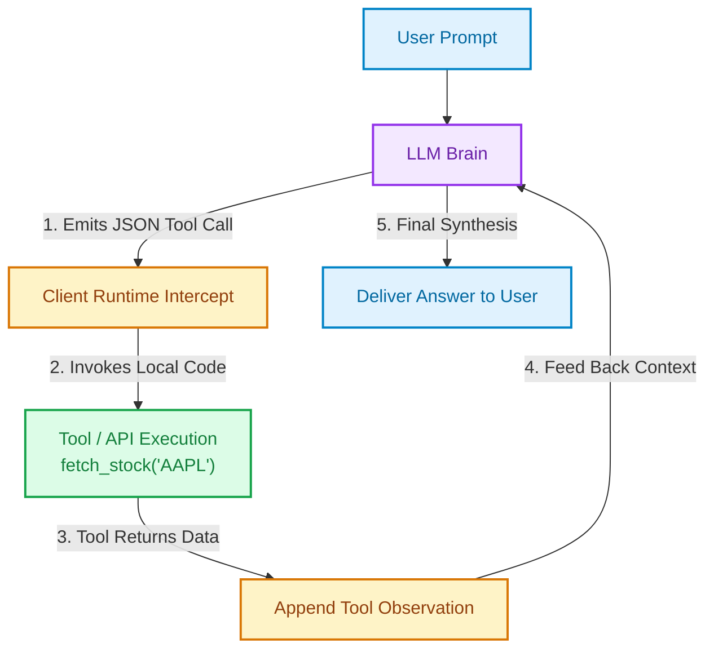
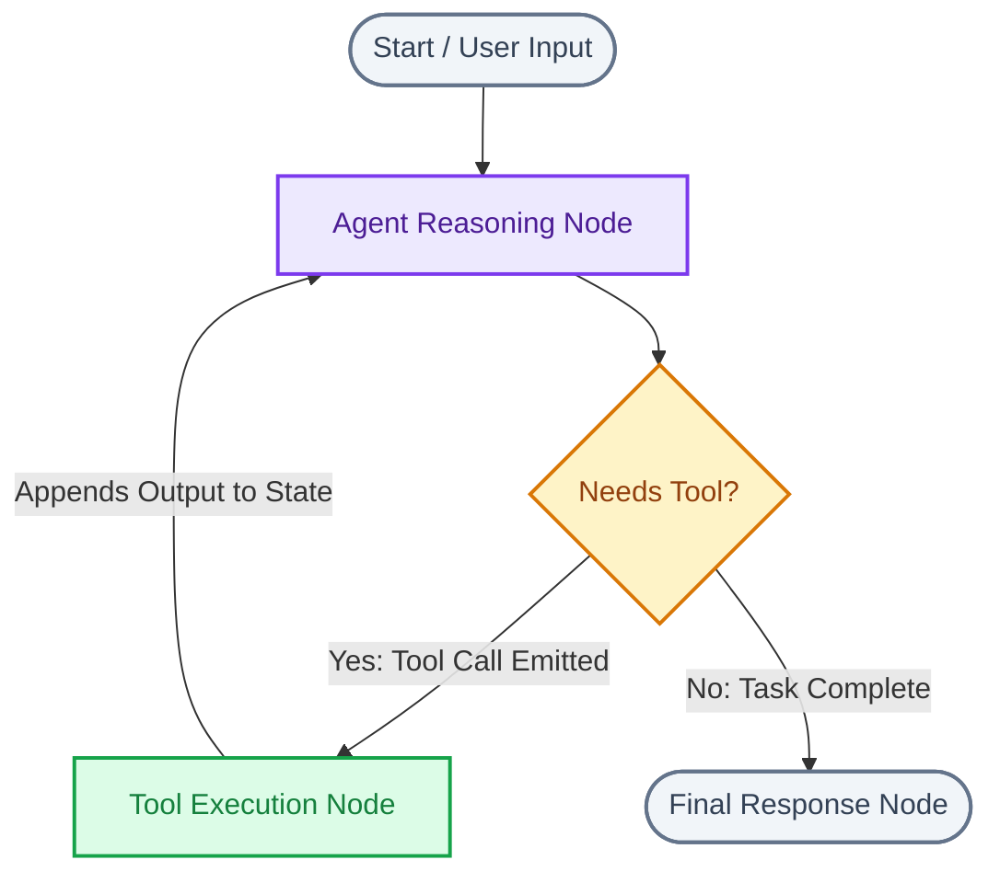

# Module 08: Tools, Function Calling & Orchestration

This module covers how autonomous agents interact with external systems using **Function Calling**, and how to orchestrate non-linear, multi-step workflows using modern frameworks like **LangGraph**.

---

## Section 1: Tools & Function Calling Mechanics

### Q1: How does Function Calling work under the hood in modern LLMs?
**Answer:**
LLMs cannot directly invoke code or send HTTP requests. Instead, **Function Calling** is a structured protocol:
1. **Schema Definition:** You pass the LLM a list of tool descriptions defined as JSON Schemas (tool names, descriptions, parameter types, and required fields).
2. **Intent & Argument Generation:** During token generation, if the LLM determines that a tool is needed, it emits a special token indicating a tool call and outputs a structured JSON object containing the function name and arguments.
3. **Client Execution:** Your backend application intercepts this JSON, runs the actual Python/API code locally, and captures the return value.
4. **Tool Observation:** You append a `tool` role message containing the function's output to the conversation history and send it back to the LLM for a final conversational answer.



---

### Q2: How do you define a production-grade OpenAI tool schema in Python?
**Answer:**
```python
tools = [
    {
        "type": "function",
        "function": {
            "name": "get_weather_forecast",
            "description": "Fetches current weather and 3-day forecast for a specified city.",
            "parameters": {
                "type": "object",
                "properties": {
                    "city": {
                        "type": "string",
                        "description": "The city and state, e.g. San Francisco, CA or London, UK"
                    },
                    "unit": {
                        "type": "string",
                        "enum": ["celsius", "fahrenheit"],
                        "description": "Temperature unit preferred by the user."
                    }
                },
                "required": ["city"],
                "additionalProperties": False
            }
        }
    }
]
```
> **Key Interview Tip:** Tool descriptions are **prompts**. High-quality descriptions that specify *when* and *when not* to use the tool prevent tool hallucinations.

---

## Section 2: Orchestration: LangChain vs. LangGraph

### Q3: Why do Directed Acyclic Graphs (DAGs) fail for real-world agents, and why is LangGraph needed?
**Answer:**
Traditional pipelines (like early LangChain Chains or Airflow) are **DAGs** (Directed Acyclic Graphs): they only move in one direction from Start to Finish.
- Real-world agents require **Cycles (Loops)**: an agent must execute a tool, read the result, inspect if an error occurred, and potentially retry or loop through alternative steps.
- **LangGraph** models agent architectures as a **Stateful, Cyclical Graph**:
  - **State:** A centralized, typed data structure (usually a TypedDict or Pydantic class) tracking all messages and variables.
  - **Nodes:** Python functions that receive the current state, perform work, and return updated state.
  - **Edges:** Deterministic or conditional routing functions determining which node executes next based on state data.



---

### Q4: How do you build a minimal LangGraph agent with conditional routing?
**Answer:**
```python
from typing import TypedDict, Annotated, List
import operator

# 1. Define the Central State
class AgentState(TypedDict):
    messages: Annotated[List[str], operator.add]
    next_step: str

# 2. Define Nodes (Units of Work)
def agent_reasoning_node(state: AgentState) -> dict:
    last_msg = state["messages"][-1]
    print(f"[Agent] Reasoning on: {last_msg}")
    
    # Conditional decision
    if "calculate" in last_msg.lower():
        return {"messages": ["Calling calculator..."], "next_step": "tool"}
    return {"messages": ["Task complete!"], "next_step": "end"}

def tool_execution_node(state: AgentState) -> dict:
    print("[Tool] Executing math computation...")
    result = "Calculation result: 42"
    return {"messages": [result], "next_step": "agent"}

# 3. Define Conditional Routing Logic
def route_step(state: AgentState) -> str:
    if state["next_step"] == "tool":
        return "tool_node"
    return "__end__"

# In production, assemble with StateGraph:
# workflow = StateGraph(AgentState)
# workflow.add_node("agent", agent_reasoning_node)
# workflow.add_node("tool_node", tool_execution_node)
# workflow.add_conditional_edges("agent", route_step)
# workflow.add_edge("tool_node", "agent")
# app = workflow.compile()
```

---

## Section 3: Google Agent Development Kit (ADK)

### Q5: What is Google Agent Development Kit (ADK) and how does it simplify agent orchestration?
**Answer:**
The **Google Agent Development Kit (ADK)** is an open-source, code-first framework designed by Google to standardize how enterprise agents are built, debugged, and deployed.
- **Code-First Architecture:** Treats agent definition as standard software engineering rather than complex prompt-wrapping hacks.
- **Model & Deployment Agnostic:** While optimized for Gemini and Vertex AI, ADK works across LLMs and deploys seamlessly to Google Cloud Run, GKE, or local Docker.
- **Built-in Developer CLI:**
  - `adk create my_agent`: Scaffolds a production-ready agent package.
  - `adk web`: Launches a local graphical chat UI with full visual debugging and tool inspection.
  - `adk run agent.py`: Runs the agent directly in terminal mode.
  - `adk deploy cloud_run`: One-command deployment to serverless infrastructure.

```python
# Minimal Google ADK Agent (agent.py)
from google.adk.agents.llm_agent import Agent

# Define a native Python tool
def get_stock_price(ticker: str) -> dict:
    """Returns the current market stock price for a given ticker."""
    # In production, call real financial API
    return {"ticker": ticker, "price": 230.50, "currency": "USD"}

# Define the root agent
root_agent = Agent(
    model='gemini-2.5-flash',
    name='finance_agent',
    description="Analyzes stock performance and answers market queries.",
    instruction="You are an expert financial research assistant. Always use 'get_stock_price' to fetch current data.",
    tools=[get_stock_price],
)
```

---

## Section 4: Human-in-the-Loop (HITL) & Safety Interrupts

### Q6: What is Human-in-the-Loop (HITL) and how is it implemented in agent graphs?
**Answer:**
When agents perform high-stakes operations (e.g., executing SQL `DELETE`, sending an email to a client, initiating a financial transaction), fully autonomous execution is dangerous.
- **HITL Interrupt:** The agent graph pauses execution right *before* executing the tool node and checkpoints the entire state to a database.
- **Review:** A human operator reviews the proposed action and parameters in a UI dashboard.
- **Resume:** Upon approval (or manual edit of the arguments), the graph wakes up from the checkpoint and completes execution.

---

## Key Takeaways for Interviews
- Function Calling is an API contract: the LLM creates the JSON plan, the client executes it.
- **LangGraph** enables cyclical loops and state persistence for non-linear agents.
- **Google ADK** brings code-first engineering, built-in visual debugging (`adk web`), and one-click cloud deployment.
- Always implement **Human-in-the-Loop** interrupts for irreversible or destructive actions.

---

[← Previous: Module 07 - AI Agents Fundamentals](./07_ai_agents_fundamentals.md) | [Next: Module 09 - Multi-Agent Systems & MCP →](./09_multi_agent_systems_and_mcp.md)
