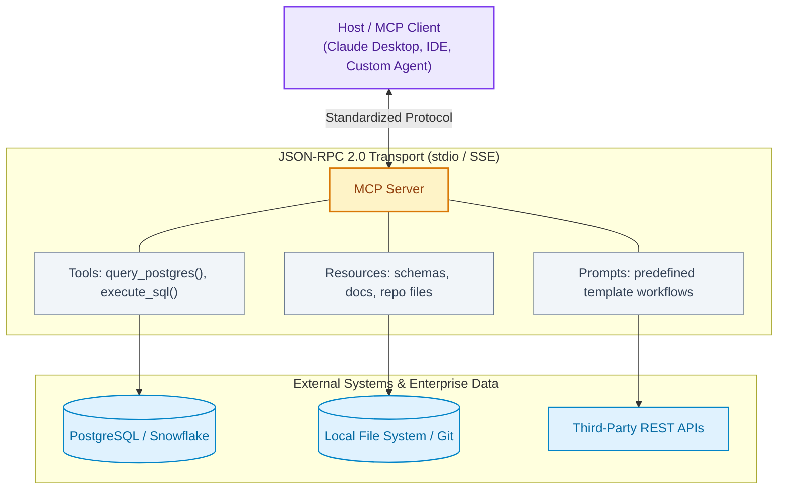

```mermaid
flowchart TD
    subgraph S1["1. Sequential Pipeline"]
        direction LR
        P_IN["User Input"] --> P_RES["Researcher Agent"] --> P_WRT["Writer Agent"] --> P_EDT["Editor Agent"] --> P_OUT["Final Article"]
    end

    subgraph S2["2. Hierarchical Supervisor Pattern"]
        direction TB
        SUP["Supervisor Agent<br/>(Planner & Coordinator)"]
        W1["Researcher Subagent"]
        W2["Code Executor Subagent"]
        W3["Reviewer Subagent"]
        
        SUP -->|Delegates Task| W1
        SUP -->|Delegates Task| W2
        SUP -->|Delegates Task| W3
        W1 -->|Returns Artifact| SUP
        W2 -->|Returns Artifact| SUP
        W3 -->|Returns Artifact| SUP
    end

    subgraph S3["3. Collaborative Dialogue (AutoGen)"]
        direction LR
        AG1["Coder Agent"] <-->|Dynamic Peer Critique & QA| AG2["Tester Agent"]
    end

    classDef seqStyle fill:#E0F2FE,stroke:#0284C7,stroke-width:1.5px,color:#0369A1;
    classDef supStyle fill:#EDE9FE,stroke:#7C3AED,stroke-width:2px,color:#4C1D95;
    classDef workerStyle fill:#FEF3C7,stroke:#D97706,stroke-width:1.5px,color:#92400E;
    classDef autoStyle fill:#DCFCE7,stroke:#16A34A,stroke-width:1.5px,color:#15803D;

    class P_IN,P_RES,P_WRT,P_EDT,P_OUT seqStyle;
    class SUP supStyle;
    class W1,W2,W3 workerStyle;
    class AG1,AG2 autoStyle;
```

# Module 09: Multi-Agent Systems & Model Context Protocol (MCP)

This module explores how to coordinate **teams of specialized AI agents** to solve complex enterprise problems, and how the **Model Context Protocol (MCP)** standardizes secure tool and data integration.

---

## Section 1: Why Multi-Agent Systems?

### Q1: Why use multiple specialized agents instead of one large generalist agent?
**Answer:**
Giving a single agent 30 different tools and a 20-page system prompt inevitably leads to failure:
1. **Prompt Saturation & Confusion:** LLMs struggle to select the right tool when overloaded with too many schema definitions.
2. **Context Degradation:** A single agent's context window quickly fills with irrelevancies from intermediate tool outputs, causing hallucinations.
3. **Lack of Specialization:** Different tasks require different personas and prompt temperatures (e.g., creative brainstorming vs. strict code execution).
4. **Multi-Agent Advantage:** Divides the task into focused roles (e.g., Researcher, Coder, Reviewer). Each agent has a small, clean context and only 2–3 tools, vastly improving reliability.

---

### Q2: What are the three primary Multi-Agent architectures?
**Answer:**


---

## Section 2: Implementing Multi-Agent Teams

### Q3: How do you implement a role-playing Multi-Agent system (CrewAI pattern)?
**Answer:**
```python
# Conceptual CrewAI Architecture
class Agent:
    def __init__(self, role: str, goal: str, backstory: str, tools: list):
        self.role = role
        self.goal = goal
        self.backstory = backstory
        self.tools = tools

# 1. Define Specialized Agents
researcher = Agent(
    role="Senior Market Analyst",
    goal="Discover high-growth AI trends in 2026",
    backstory="You are an expert at analyzing industry whitepapers and SEC filings.",
    tools=["web_search", "rag_retriever"]
)

writer = Agent(
    role="Technical Content Strategist",
    goal="Write an engaging blog post summarizing the analyst's findings",
    backstory="You translate complex technical data into concise, punchy insights.",
    tools=["grammar_check"]
)

# 2. Sequential Execution Orchestration
def run_crew(topic: str):
    print(f"Starting Crew execution on: {topic}")
    research_notes = f"[Simulated Output from {researcher.role}]: 3 key AI trends found."
    final_article = f"[Simulated Output from {writer.role}]: Article based on: {research_notes}"
    return final_article

print(run_crew("Enterprise GenAI adoption"))
```

### Q4: How does Google ADK support Multi-Agent Teams and Subagent Delegation?
**Answer:**
Google ADK treats multi-agent coordination as a first-class feature through **Subagents**:
- In ADK, an `Agent` can itself be passed as a tool to a higher-level supervisor agent.
- When the parent agent needs a specialized domain task (e.g., executing code or querying legal databases), it delegates control to the subagent.
- The subagent executes its own internal loop and returns its final synthesised answer back to the parent agent.

```python
from google.adk.agents.llm_agent import Agent

# Define specialized worker subagent
code_executor_subagent = Agent(
    model='gemini-2.5-flash',
    name='code_runner',
    description="Executes Python scripts and validates mathematical computations.",
    instruction="You are a dedicated Python execution specialist.",
)

# Root supervisor agent orchestrating the subagent
root_agent = Agent(
    model='gemini-2.5-pro',
    name='lead_supervisor',
    description="Oversees multi-step research and analysis.",
    instruction="Delegate all programming and math calculations to 'code_runner'.",
    subagents=[code_executor_subagent],
)
```

---

## Section 3: The Model Context Protocol (MCP)

### Q5: What is MCP (Model Context Protocol), and what problem does it solve?
**Answer:**
Before MCP, every AI company and agent framework had to write custom, ad-hoc glue code for every external integration:
- LangChain has custom connectors for Google Drive, GitHub, Slack, Postgres, etc.
- If an API updates its format, every framework's custom wrapper breaks.

**The Model Context Protocol (MCP)**, open-sourced by Anthropic, is the "USB-C standard for AI":
- An open standard using **JSON-RPC 2.0** that decouples the AI model from data sources and tools.
- Instead of the model connecting directly to APIs, external systems expose an **MCP Server**.
- Any **MCP Client** (Claude Desktop, IDEs, custom agents) can plug into any MCP server instantly without rewriting code.



---

### Q6: How is a minimal Python MCP Tool Server structured?
**Answer:**
Using the official Python MCP SDK:
```python
from mcp.server.fastmcp import FastMCP

# Initialize an MCP Server named "weather-server"
mcp = FastMCP("Weather Service")

# Expose a tool to any connecting AI Client
@mcp.tool()
def get_current_temperature(city: str) -> str:
    """Fetch current temperature for a specified city."""
    # In production, query an actual weather API
    mock_weather = {"Seattle": "14°C", "Tokyo": "22°C"}
    return mock_weather.get(city, "18°C (Default)")

# When executed, the server listens via stdio (standard input/output):
# if __name__ == "__main__":
#    mcp.run()
```
> **Why it matters:** Once this server runs, any agent compliant with MCP can discover `get_current_temperature` dynamically, read its JSON schema, and execute it securely.

---

## Key Takeaways for Interviews
- Multi-agent systems prevent context saturation by assigning **narrow goals and small tool sets** to specialized agents.
- **Supervisor patterns** are standard for enterprise workflows requiring quality review and delegation.
- **MCP** is replacing bespoke API integrations with an open JSON-RPC standard for tools and contextual resources.

---

[← Previous: Module 08 - Tools & Orchestration](./08_tools_and_orchestration.md) | [Next: Module 10 - Agent Evaluation & Safety →](./10_agent_evaluation_and_safety.md)
