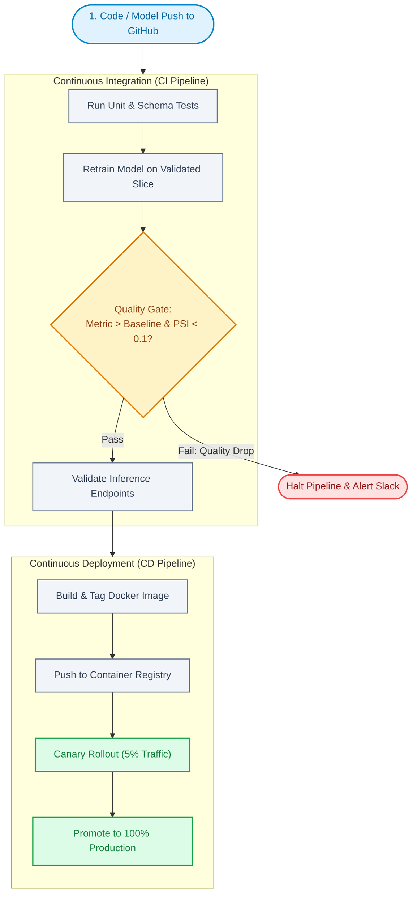

# Module 07: MLOps & Engineering Practices for Freshers

This module covers the practical engineering skills AI/ML freshers are expected to know for deploying and managing machine learning models in real-world projects.

---

## Section 1: What is MLOps?

### Q1: What is MLOps? Why is it important?
**Answer:**
**MLOps (Machine Learning Operations)** is the set of practices that combines Machine Learning with software engineering and DevOps principles to **deploy, monitor, and maintain ML models in production** reliably.

**The Problem MLOps solves:**
- A data scientist builds a model in a Jupyter notebook on their laptop → 90% accuracy!
- Then they hand it to the engineering team → It breaks on the production server.
- Or the model works initially but becomes inaccurate 3 months later because the real-world data has changed.

**MLOps ensures:**
- Models are reproducible (same code + same data = same results every time).
- Models can be deployed and scaled automatically.
- Model performance is tracked and monitored continuously.
- When something breaks, the team knows quickly.

---

### Q2: What is the difference between a Data Scientist and an ML Engineer?
**Answer:**

| | Data Scientist | ML Engineer |
|---|---|---|
| **Primary Focus** | Experiment: finding the best model | Production: deploying and maintaining the model |
| **Tools** | Jupyter Notebooks, Pandas, Matplotlib | Docker, APIs, cloud platforms, CI/CD pipelines |
| **Deliverable** | Trained model / insights | Reliable, scalable production service |
| **Skills** | Statistics, data exploration, modeling | Software engineering, DevOps, systems design |

**An AI/ML Trainee Engineer** sits between these two roles — must understand both modeling and deployment.

---

## Section 2: Model Deployment Basics

### Q3: What is an API? How do you serve an ML model as an API?
**Answer:**
An **API (Application Programming Interface)** is a way for different software systems to communicate. When you deploy an ML model as an API:
- Other apps can send data to your model over the internet.
- Your model processes it and sends back predictions.

**FastAPI** is the most popular Python framework for serving ML models:

```python
from fastapi import FastAPI
from pydantic import BaseModel
import numpy as np
import joblib

app = FastAPI()
model = joblib.load("spam_classifier.joblib") # Load your trained model

class EmailRequest(BaseModel):
  text: str

@app.post("/predict")
def predict_spam(request: EmailRequest):
  # Simple feature: word count (in real life, use TF-IDF or embeddings)
  features = [[len(request.text.split())]]
  prediction = model.predict(features)[0]
  label = "SPAM" if prediction == 1 else "NOT SPAM"
  return {"label": label}

# Run with: uvicorn main:app --reload
# Test at: http://localhost:8000/docs
```

---

### Q4: What is a REST API? What are GET, POST, PUT, DELETE?
**Answer:**
REST (Representational State Transfer) is the standard way to design APIs on the web. HTTP methods define what kind of action you're performing:

| HTTP Method | Action | ML Example |
|---|---|---|
| **GET** | Retrieve/read data | `GET /model/status` → Check if model is loaded |
| **POST** | Create/submit new data | `POST /predict` → Send input, receive prediction |
| **PUT** | Update existing data | `PUT /model/update` → Replace the model with a new version |
| **DELETE** | Delete data | `DELETE /model/cache` → Clear prediction cache |

```python
# Testing your API with Python requests
import requests

response = requests.post(
  "http://localhost:8000/predict",
  json={"text": "Congratulations! You won a free iPhone. Click now!"}
)
print(response.json()) # {"label": "SPAM"}
```

---

## Section 3: Docker for ML

### Q5: What is Docker? Why is it used in ML deployments?
**Answer:**
Docker is a tool that packages your application and all its dependencies (Python version, libraries, system files) into a single portable unit called a **Container**.

**The "Works on my machine" problem:**
```
Developer: "My model works perfectly! 98% accuracy!"
    ↓
Server:  "ModuleNotFoundError: No module named 'sklearn'"
```

Docker solves this by saying: *"If it works in my Docker container, it will work on ANY machine running Docker — your laptop, a server, or the cloud."*

**Simple Docker workflow for ML:**
```dockerfile
# Dockerfile — Recipe for your container
FROM python:3.11-slim     # Start from Python image

WORKDIR /app          # Set working directory

COPY requirements.txt .    # Copy dependencies list
RUN pip install -r requirements.txt # Install them

COPY . .            # Copy your code + model

CMD ["uvicorn", "main:app", "--host", "0.0.0.0", "--port", "8000"] # Start the server
```

```bash
# Build and run your Docker container
docker build -t my-ml-model .
docker run -p 8000:8000 my-ml-model
```

---

### Q6: What is the difference between an Image and a Container in Docker?
**Answer:**
- **Docker Image**: A read-only blueprint/recipe (like a class in Python). Built once.
- **Docker Container**: A running instance of an image (like an object from a class). You can run many containers from one image.

```
Image (Blueprint):  "python-3.11 + scikit-learn + FastAPI + my model code"
  ↓ docker run
Container (Running): An active instance serving predictions on port 8000
```

---

## Section 4: Version Control & Experiment Tracking

### Q7: Why is Git important in ML projects?
**Answer:**
Git is a version control system that tracks changes to your code files over time. It is essential in ML projects to:
- Collaborate with team members without overwriting each other's work.
- Track every change with a message: *"Changed learning rate from 0.01 to 0.001, accuracy improved 3%"*.
- Roll back to previous versions if something breaks.
- Work on different features/experiments in separate **branches** without affecting the main code.

```bash
# Common Git commands every ML fresher must know
git init             # Initialize git in your project
git add train.py model.py    # Stage files for commit
git commit -m "Add early stopping to training loop" # Save snapshot
git push origin main       # Upload to GitHub

git checkout -b experiment-new-features # Create new branch
git merge experiment-new-features    # Merge back when ready
```

---

### Q8: What is MLflow? Why do ML teams use it?
**Answer:**
**MLflow** is an open-source tool for tracking machine learning experiments. When you train many models trying different settings, it's hard to remember which configuration gave the best result.

MLflow records:
- **Parameters**: What settings you used (learning_rate=0.001, epochs=50)
- **Metrics**: Performance results (accuracy=0.91, F1=0.89)
- **Artifacts**: The saved model file, plots, confusion matrix

```python
import mlflow
from sklearn.ensemble import RandomForestClassifier
from sklearn.metrics import accuracy_score

with mlflow.start_run():
  # Log parameters
  mlflow.log_param("n_estimators", 100)
  mlflow.log_param("max_depth", 5)

  # Train model
  model = RandomForestClassifier(n_estimators=100, max_depth=5)
  model.fit(X_train, y_train)

  # Log metric
  acc = accuracy_score(y_test, model.predict(X_test))
  mlflow.log_metric("accuracy", acc)

  # Save model
  mlflow.sklearn.log_model(model, "model")

# View all experiments: mlflow ui (opens web dashboard)
```

---

## Section 5: Data Quality & Model Monitoring

### Q9: What is Data Drift? Why does it cause models to fail over time?
**Answer:**
**Data Drift** happens when the real-world data that a model receives in production **changes significantly** from the data it was trained on. This causes model accuracy to degrade silently over time.

**Real-world example:**
- A loan approval model was trained on customer data from 2020-2022.
- In 2024, a new generation of younger borrowers applies → Their income patterns, spending behavior, and credit history patterns are completely different.
- The model keeps running but gives incorrect predictions without anyone realizing!

**Types of Drift:**
1. **Data Drift (Covariate Shift):** The input features $X$ change (new customer demographics).
2. **Concept Drift:** The relationship between input and output changes (e.g., COVID changed what predicts loan default).
3. **Label Drift:** The distribution of the target labels $y$ changes (e.g., fraud rates increase from 0.1% to 5%).

**How to detect it:**
- Monitor statistical summaries (mean, std, min/max) of incoming features daily.
- Alert when significant deviation is detected.

---

### Q10: What is CI/CD? How does it apply to ML projects?
**Answer:**
**CI/CD (Continuous Integration / Continuous Deployment)** is the practice of automatically testing and deploying code changes, ensuring quality at every step.

In ML:
- **CI (Continuous Integration)**: Every time a data scientist pushes new code or a retrained model, automated tests run to check if accuracy hasn't dropped and the API still works correctly.
- **CD (Continuous Deployment)**: If all tests pass, the new model version is automatically deployed to production — no manual steps.



---

## Section 5: Data Version Control (DVC)

### Q11: What is DVC and why don't we just use Git for datasets?
**Answer:**
Git is amazing for tracking code (which is just text), but it crashes if you try to commit a 50GB CSV file or a folder of 100,000 images.
**DVC (Data Version Control)** solves this by acting like Git for massive datasets and models.
- DVC stores the actual heavy files in cloud storage (AWS S3, Google Drive).
- DVC creates a tiny `.dvc` text file that points to the exact version of the dataset in the cloud.
- You commit this `.dvc` file to Git. Now your code and data are perfectly synced without breaking Git.

---

## Section 6: Cloud Platforms for ML

### Q12: Why do ML engineers use the cloud instead of their laptops?
**Answer:**
1. **Compute Power:** Deep learning requires GPUs. Cloud platforms let you rent powerful GPUs (like A100s) by the hour instead of buying a $10,000 computer.
2. **Scalability:** If your ML API goes viral and receives 10,000 requests per minute, a cloud platform can automatically spin up 20 servers to handle the load, then scale back down to save money.

### Q13: What are the main Cloud ML Services you should know?
**Answer:**
All major cloud providers have dedicated ML platforms that handle Jupyter notebooks, model training, and API deployment in one place:
- **AWS:** Amazon SageMaker
- **Google Cloud:** Vertex AI
- **Microsoft Azure:** Azure Machine Learning

For freshers, deploying a simple model to an **AWS EC2 instance** (a virtual server) using Docker and FastAPI is a standard, highly respected portfolio project.

---

## Section 7: Statistical Drift Detection & Model Decay (MNC Standard)

### Q14: How do you statistically detect Data Drift in production?
**Answer:**
You cannot simply "eyeball" features. Industry MLOps pipelines (using tools like Evidently AI or Great Expectations) use formal statistical tests:
1. **Population Stability Index (PSI):**
   - Compares the distribution of a numerical or categorical feature between the training baseline and a recent production window (e.g., past 7 days).
   - *Rule of Thumb:*
     - $\text{PSI} < 0.1$: No significant change. Baseline is valid.
     - $0.1 \le \text{PSI} < 0.25$: Moderate drift; flag for inspection.
     - $\text{PSI} \ge 0.25$: Significant drift; trigger automated retraining pipeline.
2. **Kolmogorov-Smirnov (K-S) Test:**
   - A non-parametric test comparing the cumulative distributions of continuous features to check if they come from the same distribution.
3. **Concept Drift Detection:**
   - Track business metrics and model residuals. If input feature distributions appear stable (PSI < 0.1) but real-world accuracy or conversion drops by 15%, the underlying relationship has shifted (Concept Drift).

---

## Section 8: Feature Stores & Training-Serving Skew

### Q15: What is Training-Serving Skew, and why do companies use Feature Stores (e.g., Feast)?
**Answer:**
**Training-Serving Skew** is one of the most common and expensive bugs in production ML:
- At training time, data scientists calculate features using Pandas SQL queries (e.g., `avg_order_value_last_30_days`).
- At inference time in production, backend engineers re-implement the same feature calculation in Java/Go or FastAPI.
- Even subtle discrepancies in timezone handling, null imputation, or window boundaries create mathematical differences between what the model learned and what it sees live.

**How a Feature Store solves this:**
A Feature Store (like **Feast**, Tecton, or AWS Feature Store) acts as a centralized "single source of truth" for feature definitions:
1. **Offline Store (Snowflake/BigQuery/Parquet):** Provides high-throughput batch features with **point-in-time correctness** (time-travel joins) to prevent future data leaking into training sets.
2. **Online Store (Redis/DynamoDB):** Provides ultra-low-latency (<10ms) lookup for the exact same features during real-time inference.

---

## Section 9: ML Online Experimentation & Safe Deployments

### Q16: How do you design an A/B Test for a new Machine Learning model?
**Answer:**
Deploying a new model directly to 100% of traffic based solely on high offline accuracy is dangerous. Top companies use a rigorous A/B testing framework:
1. **Define Hypothesis & Metrics:**
   - **Primary (Success) Metric:** The business KPI you aim to improve (e.g., Click-Through-Rate, Purchase Conversion).
   - **Guardrail Metrics:** Non-negotiable system constraints that must *not* regress (e.g., p99 latency < 80ms, API error rate < 0.05%, user unsubscribe rate).
2. **Traffic Randomization:** Randomly partition traffic by unique user ID (e.g., 50% to Champion model, 50% to Challenger model) to avoid cross-contamination.
3. **Sample Size & Statistical Significance:** Run power analysis to determine how many days the test must run to achieve 95% statistical significance ($p < 0.05$) while accounting for weekend/weekday seasonality.

### Q17: What are Shadow Deployments (Dark Traffic) and Canary Releases?
**Answer:**
- **Shadow Deployment (Dark Traffic):**
  - Production requests are duplicated: sent to both the live Champion model and the new Challenger model.
  - Only the Champion model's prediction is returned to the user.
  - The Challenger model's predictions, latency, and memory footprint are logged and evaluated quietly in the background with **zero user risk**.
- **Canary Release:**
  - Route a tiny slice of live user traffic (e.g., 2% -> 10% -> 50% -> 100%) to the new model while continuously monitoring error rates and guardrails. If anomalies occur, automatically roll back instantly.

---

## Section 10: Cloud Safety, FinOps & Infrastructure Billing Protections

### Q18: What are common Cloud Billing Disasters in ML engineering, and how do you prevent them?
**Answer:**
Cloud bills in ML can skyrocket unexpectedly due to three primary traps:
1. **Orphaned GPU Compute Instances:** Launching an AWS `p4d.24xlarge` ($32/hour) or GCP `a2-highgpu` instance for experimental fine-tuning and forgetting to terminate it over the weekend, resulting in a **$5,000+ surprise bill**.
   - *Fix:* Configure auto-shutdown cron scripts and AWS CloudWatch idle alarms (`CPUUtilization < 5%` for 30 minutes triggers automatic EC2 termination).
2. **Unconstrained Horizontal Autoscaling:** An uncapped Kubernetes (EKS/GKE) or Cloud Run cluster scaling from 2 to 200 replicas during a load test or prompt-flood DDoS attack.
   - *Fix:* Always define hard maximum replica caps in Kubernetes Horizontal Pod Autoscaler (`maxReplicas: 8`).
3. **Automated Retraining Loops:** A flaky data pipeline triggers the automated CI/CD model retraining pipeline continuously every 15 minutes, consuming high-end GPU cluster hours non-stop.
   - *Fix:* Implement a retraining rate limiter (e.g., maximum once every 24 hours) and cooldown locks.

---

### Q19: How do you architect automated Cloud Cost Tripwires in AWS and GCP?
**Answer:**
Enterprises rely on automated kill-switches rather than manual email notifications:
1. **AWS FinOps Architecture:**
   - Define an **AWS Budget** with tiered alerts (50%, 80%, 100% of forecasted monthly spend).
   - If the 100% threshold is breached, AWS Budgets sends an alert to an **Amazon SNS Topic**.
   - The SNS Topic triggers an **AWS Lambda function** that modifies IAM policies to revoke API key permissions or scales the target Auto-Scaling Group down to 0 replicas.
2. **Google Cloud (GCP) FinOps Architecture:**
   - Configure **Cloud Billing Budgets** with automated programmatic notifications.
   - Connect the budget alert to a **Google Cloud Pub/Sub** topic.
   - Deploy a **Cloud Function** subscriber that disables billing on the designated sandbox project or limits API quota to $0 when spending exceeds limits.

---

### Q20: How do Spot Instances and Checkpointing reduce ML training costs by 60–80%?
**Answer:**
- **Spot / Preemptible Instances:** Cloud providers sell spare compute capacity at a **60–80% discount** compared to On-Demand pricing.
- **The Preemption Challenge:** The cloud provider can reclaim (terminate) a Spot instance with only a **30-second to 2-minute warning**.
- **Resilient Checkpointing Solution:**
  - Save model training checkpoints frequently (e.g., every 500 steps) directly to object storage (Amazon S3 or Google Cloud Storage).
  - Listen for the cloud preemption termination signal (via EC2 instance metadata `http://169.254.169.254/latest/meta-data/spot/instance-action`).
  - When the warning is caught, trigger an immediate emergency checkpoint save, flush weights, and exit gracefully.
  - An Auto-Scaling Fleet automatically spins up a new Spot instance and resumes training from the exact saved checkpoint.


