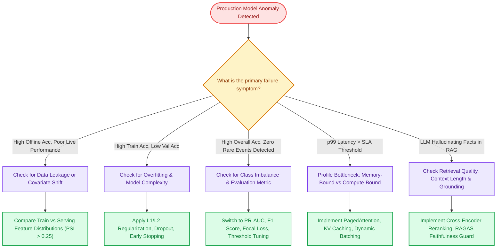

# Module 12: Practical Problem-Solving, Scenarios & System Troubleshooting

This module covers the most challenging, high-frequency **real-world scenario questions** asked during technical screenings and system design interviews for AI/ML roles. Interviewers use these questions to test whether a candidate possesses practical engineering intuition or only memorized textbook formulas.

---

## 🧭 Production ML Troubleshooting Decision Tree

When a model underperforms, crashes, or behaves unexpectedly in production, follow this structured diagnostic framework:



---

## Section 1: Data & Modeling Edge Cases

### Scenario 1: "Your model achieved 99% accuracy on the test set. Is it ready for production?"
**Best Answer:**
**Almost certainly not!** Accuracy alone is completely misleading on **imbalanced datasets**.

**Example:**
- In fraud detection, credit card transaction fraud occurs in $<0.1\%$ of cases.
- A trivial dummy model that predicts `"Legitimate"` for 100% of transactions will achieve **99.9% accuracy**, yet fail to detect a single fraudulent charge.
- In medical diagnosis, a model predicting `"No Disease"` achieves high accuracy but results in catastrophic patient mortality.

**Diagnostic Code:**
```python
from sklearn.metrics import classification_report, confusion_matrix, precision_recall_curve

# Never report raw accuracy for imbalanced classification
print(classification_report(y_true, y_pred, target_names=["Legitimate", "Fraud"]))

# Better evaluation metric: Precision-Recall AUC
from sklearn.metrics import average_precision_score
pr_auc = average_precision_score(y_true, y_pred_prob)
print(f"PR-AUC: {pr_auc:.4f}")
```

**Production Remediation:**
1. Switch to **PR-AUC (Precision-Recall Area Under Curve)** and **F1-Score**.
2. Optimize decision thresholds using cost matrices (e.g., False Negatives cost 10x more than False Positives).
3. Train with **Focal Loss** or apply SMOTE / class weighting (`class_weight='balanced'`).

---

### Scenario 2: "Your model performs well on training data but poorly on test data. How do you systematically debug it?"
**Best Answer:**
This is classic **Overfitting** (High Variance). The model memorized the training noise rather than learning generalizable representations.

**Systematic Debugging Plan:**
1. **Plot Learning Curves:** Plot Training Loss vs. Validation Loss across epochs. If training loss continues dropping while validation loss rises, overfitting is confirmed.
2. **Increase Dataset Size & Diversity:** Apply domain-specific data augmentation (MixUp, CutMix for vision; back-translation for NLP).
3. **Regularization:**
   - **L1 Regularization (Lasso):** Encourages feature sparsity.
   - **L2 Regularization (Ridge / Weight Decay):** Prevents individual weights from growing excessively large.
   - **Dropout:** Randomly zero out 20–50% of activations during forward passes in neural networks.
4. **Reduce Model Capacity:** Decrease network depth/width or prune decision trees (`max_depth=5`, `min_samples_leaf=20`).
5. **Early Stopping:** Halt training when validation metric fails to improve for $k$ consecutive epochs (patience).

---

### Scenario 3: "What is Silent Data Leakage, and how does it happen in real projects?"
**Best Answer:**
**Data Leakage** occurs when information from outside the training dataset (usually ground truth from the test set or future events) is inadvertently used to build the model. The model appears extraordinary in offline tests but collapses immediately in production.

**Top 3 Forms of Leakage:**
1. **Preprocessing Before Split:** Running `StandardScaler().fit_transform(X)` or imputing missing values over the *entire dataset* before calling `train_test_split()`.
   - *Fix:* Always fit transformers **only on the training split**, then call `.transform()` on validation/test splits. Use `sklearn.pipeline.Pipeline`.
2. **Temporal Leakage (Look-Ahead Bias):** In time-series forecasting (e.g., stock prediction or churn), using random $k$-fold cross-validation mixes future data into the past.
   - *Fix:* Use `TimeSeriesSplit` where training folds strictly precede test folds in time.
3. **Target Encoding Leakage:** Encoding high-cardinality categorical features with the mean of the target variable across all rows.
   - *Fix:* Compute out-of-fold target encoding with additive smoothing.

```python
from sklearn.pipeline import Pipeline
from sklearn.preprocessing import StandardScaler
from sklearn.linear_model import LogisticRegression

# Bulletproof approach against leakage: Scikit-Learn Pipeline
pipeline = Pipeline([
    ('scaler', StandardScaler()),       # Fits ONLY on X_train during pipeline.fit()
    ('classifier', LogisticRegression())
])
pipeline.fit(X_train, y_train)
```

---

### Scenario 4: "You receive a dataset where 45% of values in a key column are missing. What do you do?"
**Best Answer:**
Never default to blindly dropping the column or imputing with the mean. I first diagnose the **Missingness Mechanism**:

1. **Missing Completely at Random (MCAR):** Missingness is purely random (e.g., network dropped a packet). Mean/median imputation or multiple imputation (MICE) is safe.
2. **Missing at Random (MAR):** Missingness depends on other observed features (e.g., older individuals refuse to state income). Impute using group medians (e.g., median income by zip code and occupation).
3. **Missing Not at Random (MNAR):** Missingness is informative (e.g., high-income earners purposely skip the salary question). 
   - *Action:* The fact that data is missing is a **predictive signal**. Create an indicator feature `is_income_missing = 1`, and impute with median.

```python
# Best practice for high missingness: Impute + Add Missing Indicator
df['salary_is_missing'] = df['salary'].isnull().astype(int)
df['salary'] = df['salary'].fillna(df['salary'].median())
```

---

### Scenario 5: "Your model achieved 92% validation accuracy, but after 2 months in production, user complaints spike and performance drops. Why?"
**Best Answer:**
This is caused by **Distribution Shift (Dataset Drift)**:
- **Covariate Shift ($P(X)$ changes):** The distribution of input features shifts, but the underlying conditional probability $P(Y|X)$ remains constant (e.g., a credit card model built before an economic recession sees much higher average debt).
  - *Diagnosis:* Calculate **Population Stability Index (PSI)** on numerical inputs. $\text{PSI} \ge 0.25$ indicates significant covariate shift.
- **Concept Drift ($P(Y|X)$ changes):** The relationship between input features and the target label shifts (e.g., fraudsters adopt new obfuscation techniques, making previously safe transaction patterns fraudulent).
  - *Diagnosis:* Monitor rolling residual errors and business conversion KPIs.
- **Remediation:** Automate a daily drift-detection worker (using Evidently AI or Great Expectations) that triggers an automated CI/CD retraining pipeline on the most recent sliding window of production data.

---

## Section 2: Generative AI, LLMs & Agentic Scenarios

### Scenario 6: "Your RAG application frequently returns answers that sound fluent but cite non-existent sources (hallucinations). How do you fix it?"
**Best Answer:**
RAG hallucinations occur when:
1. **Retrieval Noise:** The vector database retrieves top-$k$ chunks that contain similar keywords but lack the exact factual ground truth.
2. **Lost in the Middle:** Key facts buried in the middle of a 20,000-token context window are ignored due to attention decay.
3. **Prompt Ambiguity:** The prompt permits the model to extrapolate beyond the provided text.

**Production Fixes:**
1. **Enforce Strict Grounding Prompts:**
   ```
   Answer the question STRICTLY using the context below. 
   If the answer cannot be determined directly from the context, 
   reply with: "I do not have sufficient information to answer this question."
   Do NOT use external knowledge.
   ```
2. **Cross-Encoder Reranker:** Pass the top 30 retrieved chunks through Cohere Rerank or BGE-Reranker to extract only the top 3–5 highest-relevance chunks.
3. **RAGAS Evaluation Gate:** Calculate **Faithfulness** (what % of statements in the answer are directly entailed by context) and **Answer Relevance**. If Faithfulness $<0.85$, reject the response and trigger fallback.
4. **Citation Extraction:** Require the LLM to output exact bracketed document IDs: `"[Source: doc_42, paragraph 3]"`, and programmatically verify that the cited string exists in the retrieved chunk.

---

### Scenario 7: "During fine-tuning on domain-specific medical documents, your LLM began failing basic logic and grammar tests. What happened?"
**Best Answer:**
This phenomenon is called **Catastrophic Forgetting** (Representation Collapse).
- During full-parameter fine-tuning, gradient descent updates all billions of model weights to minimize loss on the new medical dataset, overwriting the foundational reasoning and linguistic representations learned during pre-training.

**Engineering Solutions:**
1. **Parameter-Efficient Fine-Tuning (PEFT / LoRA):** Freeze 99%+ of the base model weights. Train only small low-rank adapter matrices ($A$ and $B$, where rank $r=8$ or $16$). Base model reasoning remains completely untouched.
2. **Replay Buffers / Experience Replay:** Mix in a small percentage (10–20%) of general instruction data (e.g., Dolly, Alpaca) into the medical training corpus.
3. **KL-Divergence Penalty:** Penalize the fine-tuned model if its output token probability distribution drifts too far from the frozen base model.

---

### Scenario 8: "Your production Agent gets stuck in a loop repeating the same tool call with different parameters until it times out. How do you architect a circuit breaker?"
**Best Answer:**
Autonomous agents rely on self-correction loops. When a tool returns a non-fatal error, the agent attempts to fix its input arguments. If the external environment is broken or the agent's reasoning is flawed, it enters an **infinite recursive burn loop**, wasting latency and thousands of dollars in tokens.

**Architectural Defenses:**
1. **Hard Maximum Iteration Cap:** Set `max_iterations = 6` in LangGraph or Google ADK.
2. **Tool Repetition Tripwire:** Track tool invocation history in state. If the same tool fails 3 times consecutively with identical or near-identical arguments, break the loop.
3. **Context Length Budget:** If cumulative prompt length exceeds 32,000 tokens, force summarization or terminate.
4. **Graceful Fallback Node:** Route the agent to a human-escalation node: `"I was unable to retrieve your invoice after multiple attempts. Routing this ticket to a support representative."`

---

### Scenario 9: "Your LLM serving endpoint has an SLA of 200ms p99 latency, but under peak traffic, latency spikes to 3.8 seconds. How do you optimize it?"
**Best Answer:**
I diagnose whether the bottleneck is **Compute-Bound** or **Memory-Bandwidth Bound**:
1. **Prefill vs. Decode Phase:**
   - If **Time-To-First-Token (TTFT)** is slow: The input prompt is too long ($O(N^2)$ attention). Implement **Prompt Caching** to reuse KV caches for static instructions.
   - If **Time-Per-Output-Token (TPOT)** is slow: Generation is memory-bandwidth bound. We are reading all model weights from VRAM for every token emitted.
2. **Switch to High-Throughput Serving (vLLM):**
   - Traditional PyTorch allocates contiguous blocks for KV cache, resulting in 60–80% memory fragmentation.
   - **PagedAttention** allocates non-contiguous physical pages (like OS virtual memory), unlocking 4x batch concurrency on the same GPU.
   - **Continuous Batching:** Evicts finished sequences immediately so new requests join running batches token-by-token.
3. **Semantic Response Caching (Redis):** Cache high-frequency query embeddings. Serve identical or semantically equivalent queries ($\text{sim} \ge 0.96$) in $<15\text{ms}$ at $0 token cost.
4. **Quantization:** Deploy AWQ or FP8 8-bit quantized models to cut memory footprint in half without noticeable reasoning loss.

---

## Section 3: Recommendation Systems & High-Scale Systems

### Scenario 10: "How do you solve the Cold Start problem for new users and new items in a Recommendation Engine?"
**Best Answer:**
The **Cold Start Problem** occurs when an algorithm cannot make accurate inferences because it lacks interaction history (clicks, ratings, views).

**Solutions for New Users (Zero History):**
1. **Onboarding Questionnaire:** Prompt users during signup to select 3 favorite categories or tags.
2. **Contextual Signals:** Use real-time session signals (geography, device type, referrer URL, time of day).
3. **Popularity Fallback:** Recommend globally trending items or top-rated items in the user's country.

**Solutions for New Items (Zero Interactions):**
1. **Content-Based Dual-Tower Alignment:** Pass product title, image, and category description through a text/image encoder (e.g., CLIP or BERT) to place the new item in the embedding space immediately.
2. **Multi-Armed Bandits ($\epsilon$-Greedy / Thompson Sampling):** Allocate a small percentage of feed traffic (e.g., 5%) to show newly uploaded items to users to collect initial interaction data (Exploration vs. Exploitation).

---

### Scenario 11: "What is a Feedback Loop in recommendation feeds, and why is it dangerous?"
**Best Answer:**
A **Feedback Loop (Filter Bubble / Rich-Get-Richer Effect)** happens when a model's own historical recommendations dictate future training data:
- The model recommends popular Item A slightly more often.
- Because Item A is shown more often, users click Item A more frequently.
- The model retrains on these clicks, concluding that Item A is overwhelmingly the best item.
- Niche, diverse, or higher-quality items are starved of impressions and disappear from recommendations.

**Mitigation Strategies:**
1. **Inverse Propensity Scoring (IPS):** Reweight training samples by the inverse probability of the item having been displayed ($w_i = \frac{1}{P(\text{Impression})}$), penalizing overexposed items.
2. **Diversity Post-Processing (MMR):** Apply **Maximal Marginal Relevance** during ranking to penalize items that are too similar to already selected items.
3. **Exploration Traffic (Epsilon-Greedy):** Always reserve 5–10% of slots for random or exploratory items.

---

## Section 4: System Architecture & Interview Frameworks

### Scenario 12: "How do you structure an end-to-end ML problem from scratch during a system design interview?"
**Best Answer:**
I structure the answer using the **7-Step End-to-End ML Framework**:
1. **Problem Framing & Business KPI:** Translate the business objective (e.g., *"Reduce churn"*) into an ML formulation (Binary Classification) and tie offline metrics (PR-AUC) to business impact ($$ saved in retained revenue).
2. **Data Ingestion & Label Definition:** Define label windows (e.g., *"User was inactive for 30 days"*), handle class imbalance, and ensure point-in-time correctness to prevent data leakage.
3. **Feature Engineering & Store:** Identify static features (demographics), dynamic features (30-day login frequency), and register them in a feature store (Feast).
4. **Model Architecture & Baseline:** Establish a simple, interpretable baseline (Logistic Regression) before iterating with ensemble models (XGBoost) or neural architectures.
5. **Offline Evaluation & Validation Strategy:** Time-based cross-validation splitting by user ID; evaluate using Confusion Matrix, Calibration Curves, and Cost-Benefit Thresholds.
6. **Deployment & Serving:** Package model in Docker, serve via FastAPI, define p99 latency SLA, and run Shadow (Dark Traffic) deployments before a 5% Canary rollout.
7. **Monitoring & Governance:** Continuously track Population Stability Index (PSI), Concept Drift, and latency, backed by automated retrain triggers.

---

### Scenario 13: "What do you do when PyTorch throws a CUDA Out-of-Memory (OOM) error during training?"
**Best Answer:**
1. **Reduce Batch Size with Gradient Accumulation:** Cut physical batch size by half (e.g., from 64 to 16) and accumulate gradients over 4 steps before calling `optimizer.step()`:
   ```python
   loss = model(inputs) / 4
   loss.backward()
   if (i + 1) % 4 == 0:
       optimizer.step()
       optimizer.zero_grad()
   ```
2. **Mixed Precision Training (AMP):** Use `torch.cuda.amp.autocast()` to compute activations in FP16 or BF16, slashing VRAM usage by 50% and doubling Tensor Core throughput.
3. **Gradient Checkpointing:** Recompute activations during the backward pass instead of storing all intermediate feature maps in VRAM during the forward pass (trades 20% compute time for 60% memory savings).
4. **Distributed Sharding (FSDP / DeepSpeed ZeRO):** Shard model weights, gradients, and optimizer states across multiple GPUs.

---

### Scenario 14: "Your team has three conflicting goals: increase user engagement, minimize latency, and reduce cloud inference costs. How do you resolve this trade-off?"
**Best Answer:**
This is an **Optimization under Constraints** problem.
1. **Designate a North Star Metric:** Choose one primary objective to maximize (e.g., *User Engagement / Conversion*).
2. **Convert Others to Hard Guardrail Constraints:**
   - *Constraint 1:* p99 Latency $\le 120\text{ms}$.
   - *Constraint 2:* Cloud inference cost $\le \$0.002$ per active session.
3. **Architectural Compromise (Model Cascading):**
   - Use a lightweight, fast model (or semantic cache) for 80% of simple queries, satisfying the latency and cost constraints.
   - Escalate only the top 20% high-value or ambiguous queries to the large, computationally expensive model to maximize engagement.
4. **Continuous A/B Testing:** Evaluate different operating points on the Pareto Frontier to confirm that cost cuts do not erode revenue.

---

## Key Takeaways for Interviews
- Never evaluate imbalanced datasets with raw accuracy; always discuss **PR-AUC, F1, and cost-matrix thresholds**.
- Identify data leakage by checking whether **validation information leaked into training transformations**.
- Counteract distribution shift by monitoring **Population Stability Index (PSI)** and automating retraining pipelines.
- Resolve multi-objective conflicts by defining **one North Star metric and treating others as non-negotiable guardrail constraints**.

---

[← Previous: Module 11 - MLOps & AI Engineering](./11_mlops_and_ai_engineering.md) | [Next: Module 13 - Hands-On Coding Challenges →](./13_practical_coding_challenges.md)
