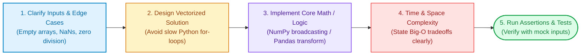

# Module 13: Practical Coding Challenges & Algorithms from Scratch

While conceptual and system design questions test high-level architecture, virtually every technical interview for freshers begins with a **hands-on live coding screening**. Interviewers look for clean code, avoidance of slow Python loops in favor of vectorized operations, proper edge-case handling, and rigorous computational complexity analysis ($O(N)$ Time & Space).

---

## 🎯 The ML Live-Coding Interview Flow

Follow this systematic 5-step approach during live coding rounds:



---

## Section 1: Core ML Algorithms from Scratch (NumPy)

### Challenge 1: Vectorized Linear Regression with Gradient Descent
**Problem:** Implement a multivariate Linear Regression class from scratch using pure NumPy. Do not use Scikit-Learn. Support multiple features ($X \in \mathbb{R}^{N \times D}$).

```python
import numpy as np

class LinearRegressionScratch:
    def __init__(self, learning_rate: float = 0.01, epochs: int = 1000):
        self.lr = learning_rate
        self.epochs = epochs
        self.weights = None
        self.bias = None

    def fit(self, X: np.ndarray, y: np.ndarray):
        n_samples, n_features = X.shape
        self.weights = np.zeros(n_features)
        self.bias = 0.0

        for _ in range(self.epochs):
            # 1. Forward Pass (Vectorized prediction)
            y_pred = np.dot(X, self.weights) + self.bias
            error = y_pred - y

            # 2. Compute Gradients
            dw = (2 / n_samples) * np.dot(X.T, error)
            db = (2 / n_samples) * np.sum(error)

            # 3. Gradient Descent Update
            self.weights -= self.lr * dw
            self.bias -= self.lr * db

        return self

    def predict(self, X: np.ndarray) -> np.ndarray:
        return np.dot(X, self.weights) + self.bias

# Unit Test Assertion
X_test = np.array([[1, 2], [2, 3], [3, 4], [4, 5]], dtype=float)
y_test = np.array([5, 8, 11, 14], dtype=float) # y = 1*x1 + 2*x2 + 0

model = LinearRegressionScratch(learning_rate=0.05, epochs=2000).fit(X_test, y_test)
preds = model.predict(np.array([[5, 6]]))
print(f"Predicted: {preds[0]:.2f} (Expected: 17.00)")
assert np.isclose(preds[0], 17.0, atol=0.1)
```
- **Time Complexity:** $O(\text{epochs} \times N \times D)$ — fully vectorized matrix operations.
- **Space Complexity:** $O(D)$ for weight storage.

---

### Challenge 2: Compute Full Classification Metrics & Confusion Matrix
**Problem:** Given binary prediction ground truth and predicted labels, compute Accuracy, Precision, Recall, F1-Score, and Confusion Matrix handling potential division by zero safely.

```python
def compute_classification_metrics(y_true: list[int], y_pred: list[int]) -> dict:
    assert len(y_true) == len(y_pred), "Arrays must be equal length."
    
    tp = sum(1 for yt, yp in zip(y_true, y_pred) if yt == 1 and yp == 1)
    tn = sum(1 for yt, yp in zip(y_true, y_pred) if yt == 0 and yp == 0)
    fp = sum(1 for yt, yp in zip(y_true, y_pred) if yt == 0 and yp == 1)
    fn = sum(1 for yt, yp in zip(y_true, y_pred) if yt == 1 and yp == 0)

    total = len(y_true)
    accuracy = (tp + tn) / total if total > 0 else 0.0
    precision = tp / (tp + fp) if (tp + fp) > 0 else 0.0
    recall = tp / (tp + fn) if (tp + fn) > 0 else 0.0
    f1 = (2 * precision * recall) / (precision + recall) if (precision + recall) > 0 else 0.0

    return {
        "confusion_matrix": {"TP": tp, "TN": tn, "FP": fp, "FN": fn},
        "accuracy": round(accuracy, 4),
        "precision": round(precision, 4),
        "recall": round(recall, 4),
        "f1_score": round(f1, 4)
    }

# Unit Test
metrics = compute_classification_metrics([1, 1, 0, 1, 0, 0, 1, 0], [1, 0, 0, 1, 0, 1, 1, 0])
print(metrics)
assert metrics["precision"] == 0.75
assert metrics["f1_score"] == 0.75
```

---

### Challenge 3: Vectorized Cosine Similarity & K-Nearest Neighbors
**Problem:** Compute pairwise cosine similarity between query vector $q \in \mathbb{R}^D$ and document matrix $D \in \mathbb{R}^{N \times D}$, and retrieve the top-$K$ most similar indices.

```python
import numpy as np

def top_k_cosine_search(query: np.ndarray, corpus: np.ndarray, k: int = 3) -> tuple[np.ndarray, np.ndarray]:
    """
    Vectorized Cosine Similarity:
    cos(q, d) = (q . d) / (||q|| * ||d||)
    """
    # 1. Compute L2 norms
    query_norm = np.linalg.norm(query)
    corpus_norms = np.linalg.norm(corpus, axis=1)

    # Avoid division by zero
    query_norm = np.maximum(query_norm, 1e-12)
    corpus_norms = np.maximum(corpus_norms, 1e-12)

    # 2. Vectorized dot products across all N documents
    dot_products = np.dot(corpus, query)

    # 3. Compute cosine similarities
    similarities = dot_products / (corpus_norms * query_norm)

    # 4. Extract top-k indices (argsort in descending order)
    top_indices = np.argsort(similarities)[::-1][:k]
    top_scores = similarities[top_indices]

    return top_indices, top_scores

# Unit Test
doc_matrix = np.array([
    [1.0, 0.0, 1.0],   # Doc 0
    [0.0, 1.0, 0.0],   # Doc 1
    [1.0, 0.9, 1.0],   # Doc 2 (Very close to query)
    [0.1, 0.0, 0.0]    # Doc 3
])
q = np.array([1.0, 1.0, 1.0])

indices, scores = top_k_cosine_search(q, doc_matrix, k=2)
print("Top Document Indices:", indices)
print("Top Cosine Scores:", scores)
assert indices[0] == 2  # Doc 2 should be the most similar
```
- **Time Complexity:** $O(N \times D)$ — single matrix-vector multiplication.
- **Space Complexity:** $O(N)$ for similarity array.

---

### Challenge 4: Numerically Stable Softmax & Cross-Entropy Loss
**Problem:** Implement the Softmax function and Cross-Entropy loss in NumPy such that large logits (e.g., $z = 1000$) do not cause numerical floating-point overflow (`NaN` / `Inf`).

```python
import numpy as np

def stable_softmax(logits: np.ndarray) -> np.ndarray:
    """
    Subtracting max(logits) eliminates exponential overflow:
    exp(z_i - max(z)) / sum(exp(z_j - max(z)))
    """
    # Subtract max along last axis for numerical stability
    shifted_logits = logits - np.max(logits, axis=-1, keepdims=True)
    exp_scores = np.exp(shifted_logits)
    return exp_scores / np.sum(exp_scores, axis=-1, keepdims=True)

def categorical_cross_entropy(probs: np.ndarray, y_true: np.ndarray) -> float:
    """
    Cross Entropy = - (1/N) * sum(log(p_correct_class))
    """
    n_samples = probs.shape[0]
    # Clip probabilities to prevent log(0)
    clipped_probs = np.clip(probs, 1e-15, 1.0)
    log_likelihood = -np.log(clipped_probs[range(n_samples), y_true])
    return float(np.mean(log_likelihood))

# Test with huge numbers that would overflow naive exp()
extreme_logits = np.array([[1000.0, 1001.0, 1002.0]])
probs = stable_softmax(extreme_logits)
print("Stable Softmax Probabilities:", probs)
assert not np.isnan(probs).any()
assert np.isclose(np.sum(probs), 1.0)
```

---

### Challenge 5: K-Means Clustering Algorithm from Scratch
**Problem:** Implement the K-Means clustering algorithm using NumPy (centroid initialization, Euclidean distance matrix, cluster assignment, and centroid recalculation loop).

```python
import numpy as np

class KMeansScratch:
    def __init__(self, k: int = 3, max_iters: int = 100):
        self.k = k
        self.max_iters = max_iters
        self.centroids = None

    def fit(self, X: np.ndarray):
        np.random.seed(42)
        # 1. Randomly initialize centroids from existing points
        random_indices = np.random.choice(X.shape[0], self.k, replace=False)
        self.centroids = X[random_indices]

        for _ in range(self.max_iters):
            # 2. Vectorized Euclidean distance calculation (N x K matrix)
            # ||X - C||^2 = ||X||^2 + ||C||^2 - 2 * X . C^T
            distances = np.linalg.norm(X[:, np.newaxis] - self.centroids, axis=2)
            
            # 3. Assign each point to closest centroid
            labels = np.argmin(distances, axis=1)

            # 4. Recalculate centroids as cluster means
            new_centroids = np.array([
                X[labels == i].mean(axis=0) if len(X[labels == i]) > 0 else self.centroids[i]
                for i in range(self.k)
            ])

            # 5. Check for convergence
            if np.allclose(self.centroids, new_centroids):
                break
            self.centroids = new_centroids

        return self

    def predict(self, X: np.ndarray) -> np.ndarray:
        distances = np.linalg.norm(X[:, np.newaxis] - self.centroids, axis=2)
        return np.argmin(distances, axis=1)

# Unit Test
X_cluster = np.array([[1.0, 1.0], [1.5, 1.2], [9.0, 9.0], [9.5, 8.8]])
kmeans = KMeansScratch(k=2).fit(X_cluster)
preds = kmeans.predict(X_cluster)
assert preds[0] == preds[1]  # Points 0 and 1 belong to same cluster
assert preds[2] == preds[3]  # Points 2 and 3 belong to same cluster
assert preds[0] != preds[2]  # Clusters must be distinct
print("K-Means successfully converged!")
```

---

## Section 2: Data Wrangling & Feature Engineering (Pandas)

### Challenge 6: Clean a Corrupted Real-World Production Dataset
**Problem:** You receive a messy Pandas DataFrame with missing values, string numbers with currency symbols, negative invalid ages, and duplicates. Write an idempotent cleaning function.

```python
import pandas as pd
import numpy as np

def clean_employee_data(raw_df: pd.DataFrame) -> pd.DataFrame:
    df = raw_df.copy()

    # 1. Drop complete duplicate records
    df = df.drop_duplicates()

    # 2. Remove rows where mandatory identifier is missing
    df = df.dropna(subset=['employee_id'])

    # 3. Clean 'age' column: convert invalid negative numbers to NaN, impute with median
    df['age'] = pd.to_numeric(df['age'], errors='coerce')
    df.loc[df['age'] <= 0, 'age'] = np.nan
    df['age'] = df['age'].fillna(df['age'].median())

    # 4. Clean 'salary' column: strip '$', commas, handle 'N/A' strings, convert to float
    if df['salary'].dtype == object:
        df['salary'] = (
            df['salary']
            .astype(str)
            .str.replace(r'[\$,]', '', regex=True)
            .replace(['nan', 'N/A', 'none', ''], np.nan)
        )
    df['salary'] = pd.to_numeric(df['salary'], errors='coerce')
    # Impute missing salary using median of respective department
    df['salary'] = df['salary'].fillna(df.groupby('department')['salary'].transform('median'))

    # 5. Parse dates safely
    df['join_date'] = pd.to_datetime(df['join_date'], errors='coerce')

    return df.reset_index(drop=True)

# Test DataFrame
dirty_df = pd.DataFrame({
    'employee_id': ['E01', 'E02', 'E01', 'E03', None],
    'department': ['Engineering', 'Engineering', 'Engineering', 'HR', 'HR'],
    'age': [28, -5, 28, 35, 40],
    'salary': ['$120,000', 'N/A', '$120,000', '75000', '$80,000'],
    'join_date': ['2022-01-15', '2023-04-01', '2022-01-15', 'invalid_date', '2021-11-20']
})

cleaned = clean_employee_data(dirty_df)
print("Cleaned DataFrame:\n", cleaned)
assert len(cleaned) == 3
assert cleaned['salary'].isnull().sum() == 0
assert (cleaned['age'] > 0).all()
```

---

## Section 3: NLP & Information Retrieval Algorithms

### Challenge 7: Implement an Inverted Index & BM25 Search Engine from Scratch
**Problem:** Implement a pure Python keyword search engine using an **Inverted Index** and the **BM25 (Best Matching 25)** ranking formula.

```python
import math
from collections import defaultdict, Counter

class BM25SearchEngine:
    def __init__(self, k1: float = 1.5, b: float = 0.75):
        self.k1 = k1
        self.b = b
        self.corpus_size = 0
        self.avg_doc_len = 0.0
        self.doc_lengths = {}
        self.doc_freqs = defaultdict(int)
        self.inverted_index = defaultdict(dict)  # term -> {doc_id: term_freq}

    def fit(self, corpus: dict[int, str]):
        self.corpus_size = len(corpus)
        total_len = 0

        for doc_id, text in corpus.items():
            tokens = text.lower().split()
            self.doc_lengths[doc_id] = len(tokens)
            total_len += len(tokens)
            
            tf_counts = Counter(tokens)
            for token, count in tf_counts.items():
                self.inverted_index[token][doc_id] = count
                self.doc_freqs[token] += 1

        self.avg_doc_len = total_len / self.corpus_size if self.corpus_size > 0 else 0.0

    def search(self, query: str, top_k: int = 3) -> list[tuple[int, float]]:
        query_tokens = query.lower().split()
        scores = defaultdict(float)

        for token in query_tokens:
            if token not in self.inverted_index:
                continue
            
            # 1. Compute IDF with smoothing
            df = self.doc_freqs[token]
            idf = math.log((self.corpus_size - df + 0.5) / (df + 0.5) + 1.0)

            # 2. Score each document containing the query term
            for doc_id, tf in self.inverted_index[token].items():
                doc_len = self.doc_lengths[doc_id]
                numerator = tf * (self.k1 + 1)
                denominator = tf + self.k1 * (1 - self.b + self.b * (doc_len / self.avg_doc_len))
                scores[doc_id] += idf * (numerator / denominator)

        # Sort documents by BM25 score in descending order
        ranked = sorted(scores.items(), key=lambda x: x[1], reverse=True)[:top_k]
        return ranked

# Test Corpus
docs = {
    1: "deep learning and natural language processing in python",
    2: "classical machine learning algorithms using scikit-learn",
    3: "deep learning neural networks for computer vision"
}

bm25 = BM25SearchEngine()
bm25.fit(docs)
results = bm25.search("deep learning vision")
print("BM25 Search Results (doc_id, score):", results)
assert results[0][0] == 3  # Doc 3 contains all three terms!
```

---

## Section 4: Production LLM & API Engineering

### Challenge 8: Resilient LLM Caller with Jittered Exponential Backoff
**Problem:** Production APIs hit HTTP 429 (Rate Limit Exceeded) and 500 (Internal Server Error). Implement a robust function with exponential backoff and randomized jitter to guarantee reliability.

```python
import time
import random
from typing import Callable, Any

def retry_with_exponential_backoff(
    func: Callable[[], Any],
    max_retries: int = 4,
    initial_delay: float = 1.0,
    backoff_factor: float = 2.0,
    jitter: bool = True
) -> Any:
    delay = initial_delay
    for attempt in range(1, max_retries + 1):
        try:
            return func()
        except Exception as e:
            # Check if this was the last attempt
            if attempt == max_retries:
                print(f"[Error] Final retry {attempt} failed: {e}")
                raise e

            # Compute jittered delay
            current_delay = delay * (1 + random.uniform(0, 0.5)) if jitter else delay
            print(f"[Warning] Attempt {attempt} failed ({e}). Retrying in {current_delay:.2f}s...")
            time.sleep(current_delay)
            delay *= backoff_factor

# Unit Test with simulated flakiness
attempts = 0
def flaky_api_call():
    global attempts
    attempts += 1
    if attempts < 3:
        raise ConnectionError("Simulated HTTP 429 Rate Limit")
    return {"status": "success", "tokens": 42}

result = retry_with_exponential_backoff(flaky_api_call, max_retries=4)
print("Result:", result)
assert result["status"] == "success"
assert attempts == 3
```

---

## Key Takeaways for Interviews
- Always verify dimensions with `.shape` and utilize **NumPy broadcasting** to eliminate Python `for` loops.
- Prevent exponential overflow in Softmax and Cross-Entropy by subtracting the maximum logit.
- When cleaning data, use `pd.to_numeric(..., errors='coerce')` and group medians to maintain mathematical rigor.
- Wrap external API calls with **jittered exponential backoff** to survive rate limits and network transient errors.

---

[← Previous: Module 12 - Practical Scenarios & System Troubleshooting](./12_practical_scenarios.md) | [Back to Home Roadmap →](./README.md)
