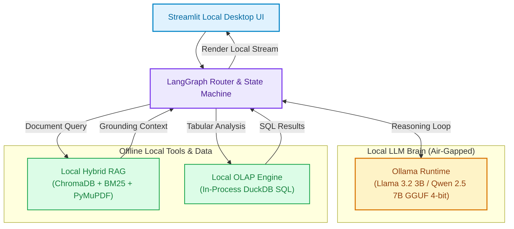
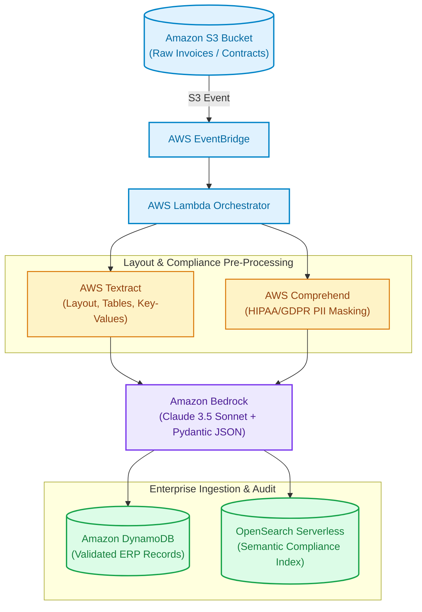
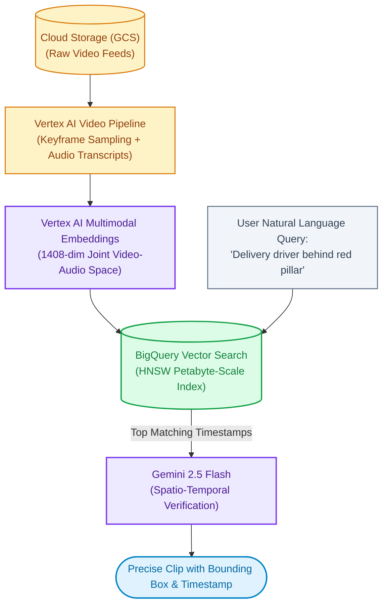
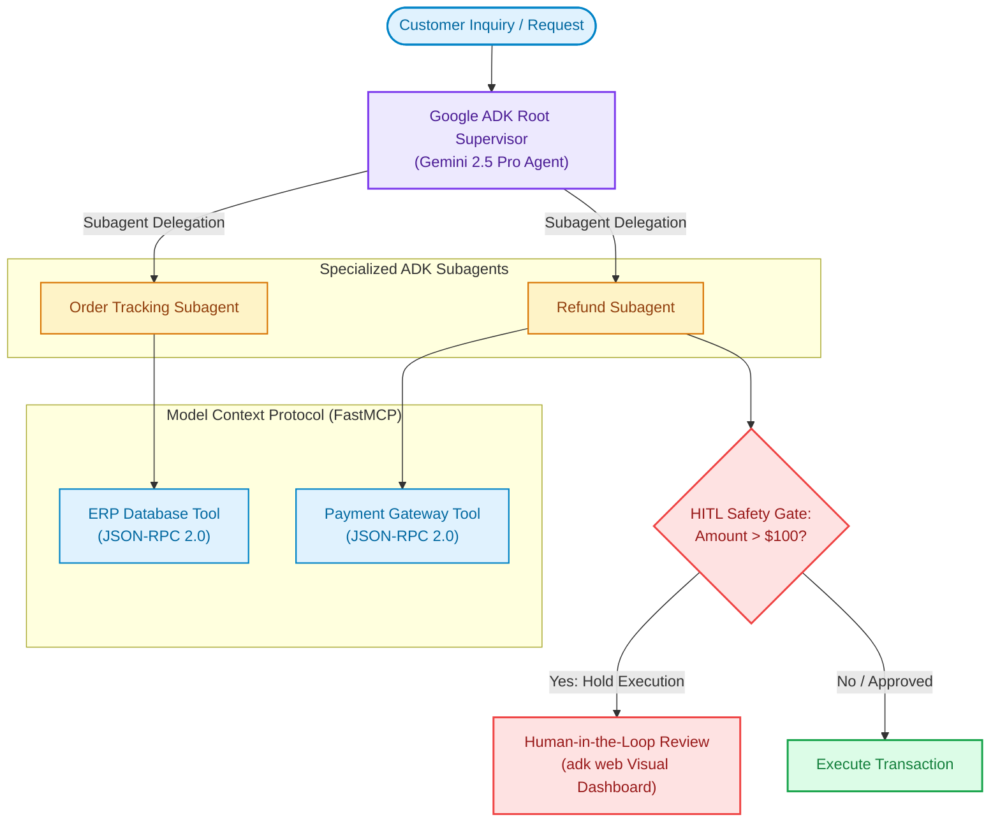
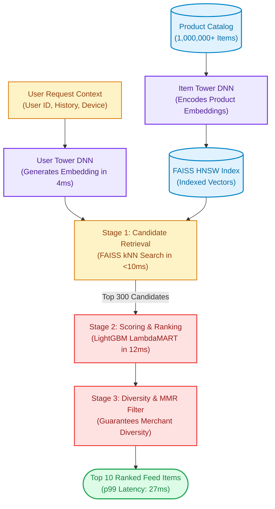
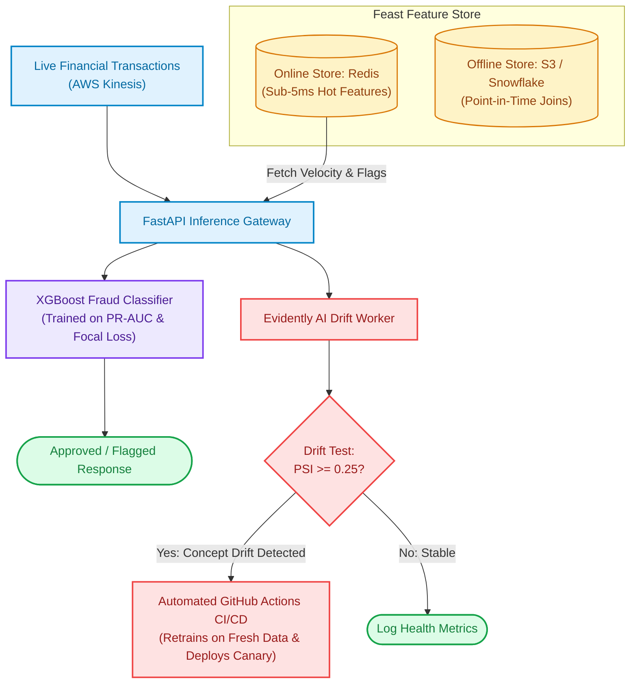
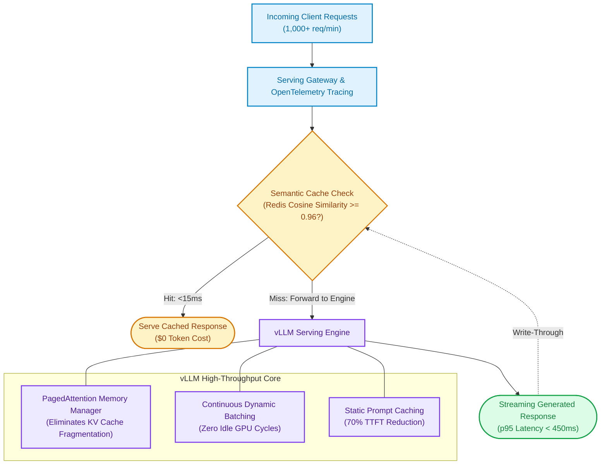

# Real-World AI/ML Portfolio Projects (Local & Cloud Mix)

A generic "PDF Chatbot" or "Iris classification script" will **not** get you hired. Hiring managers look for projects that demonstrate **system thinking**, handle **real-world edge cases (latency SLAs, token budgets, drift, class imbalance)**, and prove you can build **both locally on consumer hardware and at scale in the cloud**.

This curated collection is divided into two tracks:
1. ** 100% Local Projects ($0 Cloud Cost):** Build entirely on your laptop/workstation using open-weight models, local vector stores, and open-source tools without needing any cloud accounts or credit cards.
2. ** Cloud & Big Tech Enterprise Projects:** Mirror the exact enterprise architectures built by **Google Cloud (GCP), AWS, Meta, and Stripe** engineering teams.

---

# Track 1: 100% Local Projects ($0 Cloud Cost)
*Build and run everything locally on your Mac, Windows, or Linux laptop. No cloud API keys or credit cards required.*

---

## Local Project 1: Private Air-Gapped Desktop RAG & Multi-Tool Agent
> **Key Skills:** Ollama, Llama 3.2 / Qwen 2.5, ChromaDB (in-memory), DuckDB (SQL), LangGraph, Streamlit  
> **Hardware:** Runs on any 8GB–16GB RAM laptop or Apple Silicon / RTX GPU ($0 API Cost)

### The Problem
Law firms, healthcare clinics, and defense researchers have strict privacy regulations (HIPAA/GDPR). They cannot upload confidential documents or proprietary databases to public cloud APIs (OpenAI/Anthropic). They need an entirely **offline, air-gapped AI assistant** that runs locally on consumer hardware.

### Local Architecture & Workflow

1. **Local Model Runtime:** Run **Ollama** locally serving 4-bit quantized open-weight models (Llama 3.2 3B or Qwen 2.5 7B) consuming <4GB of VRAM.
2. **Embedded Vector Database:** Use **ChromaDB** or **LanceDB** running embedded in-process on disk to store document embeddings.
3. **Embedded Analytical Database:** Use **DuckDB** to query tabular datasets directly via SQL without running a heavy database server.
4. **Agent Orchestration:** Use **LangGraph** to route queries: retrieve facts from local PDFs or run analytical SQL aggregations over local CSVs.

### Interview Talking Points
- **Privacy & Security:** Zero bytes leave the local machine. Completely functional without an internet connection.
- **Quantization:** Explain how 4-bit GGUF quantization fits large parameter models into consumer laptop RAM without noticeable reasoning degradation.
- **Speed:** Sub-second response times using local DuckDB and small quantized models.

---

## Local Project 2: Real-Time Edge Computer Vision & Multi-Object Tracking Pipeline
> **Key Skills:** YOLOv11, OpenCV, DeepSORT / ByteTrack, FastAPI, PyTorch, Multi-threading  
> **Hardware:** Any laptop with a standard webcam or CPU/GPU ($0 Cloud Cost)

### The Problem
Physical retail stores and warehouse facilities need automated customer footfall counting, queue dwell-time analysis, and security anomaly detection. Streaming live video feeds to the cloud is cost-prohibitive and introduces bandwidth latency. Processing must happen **on-premise at the edge**.

### Local Architecture & Workflow

```mermaid
flowchart LR
    CAM["Local Webcam / RTSP Stream"] --> CAP["OpenCV Capture<br/>(Multi-Threaded Queue)"]
    CAP --> YOLO["YOLOv11 Detector<br/>(PyTorch / ONNX Runtime)"]
    YOLO --> TRACK["ByteTrack / DeepSORT<br/>(Kalman Filter ID Association)"]
    TRACK --> ZONE["Zone Analytics Engine<br/>(Line Crossing & Dwell Times)"]
    ZONE --> DASH["FastAPI + Streamlit<br/>(Live Edge HUD Dashboard)"]

    classDef input fill:#E0F2FE,stroke:#0284C7,stroke-width:2px,color:#0369A1;
    classDef cv fill:#EDE9FE,stroke:#7C3AED,stroke-width:1.5px,color:#4C1D95;
    classDef track fill:#FEF3C7,stroke:#D97706,stroke-width:1.5px,color:#92400E;
    classDef analytics fill:#FEE2E2,stroke:#EF4444,stroke-width:1.5px,color:#991B1B;
    classDef out fill:#DCFCE7,stroke:#16A34A,stroke-width:2px,color:#15803D;

    class CAM input;
    class CAP,YOLO cv;
    class TRACK track;
    class ZONE analytics;
    class DASH out;
```

1. **Multi-Threaded Ingestion:** Use Python threading to decouple video reading from model inference, preventing frame drops.
2. **Fast Object Detection:** Run **YOLOv11-nano** or **YOLOv11-small** locally using PyTorch or ONNX Runtime.
3. **Multi-Object Tracking (MOT):** Integrate **ByteTrack** or **DeepSORT** to assign a unique ID to each detected object and track them across frames even during temporary occlusions.
4. **Spatial Analytics:** Implement virtual boundary lines to count entries/exits and track dwell times in specific polygon zones.

### Interview Talking Points
- **FPS Optimization:** Explain how batching frames and using ONNX runtime boosted FPS from 12 FPS to 45 FPS on local hardware.
- **Tracking vs Detection:** Why detection alone isn't enough (it lacks memory of who is who) and how Kalman filters maintain trajectory state.

---

## Local Project 3: Autograd Engine & Character-Level Transformer from Scratch
> **Key Skills:** Pure Python, NumPy, Computational Graphs, Backpropagation, Attention Math  
> **Hardware:** Any basic laptop CPU ($0 Cloud Cost)

### The Problem
90% of junior AI candidates only know how to run `model.fit()` or `import transformers` without understanding what happens under the hood. Building the core mechanics from scratch is the single most respected way to prove deep foundational competence in technical interviews.

### Implementation Architecture
1. **Micro-Autograd Engine (Reverse-Mode Automatic Differentiation):**
   - Implement a custom `Value` class in pure Python that stores a scalar value and its gradient (`grad`).
   - Overload math operators (`__add__`, `__mul__`, `__pow__`, `relu`).
   - Build a topological DAG (Directed Acyclic Graph) of computational nodes and implement the `.backward()` chain rule function.
2. **Mini-Transformer Architecture (Pure NumPy / PyTorch from scratch):**
   - **Multi-Head Self-Attention:** Implement $Q, K, V$ matrix projections and scaled dot-product attention: $\text{softmax}\left(\frac{QK^T}{\sqrt{d_k}}\right)V$.
   - **Positional Encodings & LayerNorm:** Add sinusoidal encodings and layer normalization.
   - **Feed-Forward MLP & Cross-Entropy Loss:** Connect linear transformations with numerically stable softmax.
3. **Local Training Loop:**
   - Train on the TinyShakespeare dataset or Python code snippets locally on CPU.
   - Implement the **AdamW optimizer** manually and inspect weight gradients over training epochs.

### Interview Talking Points
- **Deep Mathematical Intuition:** Walk through the exact matrix calculus behind backpropagation and self-attention.
- **Numerical Stability:** Explain why you must subtract `max(logits)` before exponential computation in softmax to avoid floating-point overflow.

---

## Local Project 4: Full-Lifecycle Local MLOps Pipeline with MLflow, Optuna & Docker
> **Key Skills:** Scikit-Learn, XGBoost, Optuna, MLflow (Local Server), SQLite, FastAPI, Docker, Pytest  
> **Hardware:** Any laptop running Docker Desktop ($0 Cloud Cost)

### The Problem
In production, writing a machine learning model is only 10% of the job. Candidates must demonstrate the complete **ML lifecycle**: hyperparameter tuning, model artifact versioning, automated testing, containerization, and REST API serving—all configured and runnable locally.

### Implementation Architecture
1. **Automated Data Validation & Preprocessing:**
   - Ingest tabular customer churn data, run validation checks with `pydantic` / `great_expectations`.
2. **Hyperparameter Optimization with Optuna:**
   - Use Bayesian optimization via **Optuna** to search tree depth, learning rate, and regularization parameters across 50 trials.
3. **Local Experiment Tracking (MLflow):**
   - Run a local MLflow server backed by a local SQLite database (`sqlite:///mlflow.db`).
   - Log parameters, metrics (PR-AUC, F1, log-loss), confusion matrix plots, and serialized model artifacts.
   - Register the best trial as `Production` in the MLflow Model Registry.
4. **Production FastAPI Service & Dockerization:**
   - Build a REST API with `/predict` and `/health` endpoints using Pydantic request validation.
   - Package inside a minimal, multi-stage **Docker container**.
   - Write automated unit and integration tests with **Pytest**.

### Interview Talking Points
- **Point-in-Time Reproducibility:** How MLflow experiment tracking ensures any model artifact can be audited and reproduced on demand.
- **Containerization Discipline:** Multi-stage Docker builds separating build dependencies from runtime environments.

---

# Track 2: Cloud & Big Tech Enterprise Projects
*Production-scale architectures mirroring solutions built by AWS, Google Cloud (GCP), Meta, and Stripe.*

---

## Project 5 (AWS Enterprise): Serverless Intelligent Document Processing (IDP) Pipeline
> **Big Tech Focus:** How AWS Bedrock & Enterprise Solutions teams process millions of unstructured invoices, clinical trials, and legal contracts with zero manual data entry.  
> **Target Roles:** AI Engineer, Cloud ML Engineer, Solutions Architect (AWS)  
> **Key Cloud Stack:** Amazon Bedrock (Claude 3.5 Sonnet / Nova), AWS Textract, OpenSearch Serverless, AWS Comprehend (PII), AWS Lambda, EventBridge, DynamoDB

### The Problem
Fortune 500 banks and healthcare providers process hundreds of thousands of multi-page invoices, insurance claims, and loan agreements daily. Standard OCR yields messy text, manual review is prohibitively slow, and naive LLM prompts hallucinate financial figures and leak PII (HIPAA/GDPR compliance risks).

### Cloud Architecture & Workflow

1. **Event-Driven Ingestion:** Documents uploaded to S3 trigger an event via **EventBridge** to an **AWS Lambda** worker.
2. **Layout-Aware OCR:** **AWS Textract** extracts raw text while preserving tabular structures and key-value form fields.
3. **Automated PII Masking:** **AWS Comprehend** scans for HIPAA/PII entities (SSNs, medical IDs, credit card numbers) and redacts them prior to model inference.
4. **Structured JSON Extraction:** **Amazon Bedrock** runs Claude 3.5 Sonnet with strict JSON Schema constraints, transforming messy invoice tables into validated accounting payloads.
5. **Storage & Audit Index:** Structured payloads are saved to **DynamoDB** for downstream ERP consumption, while semantic embeddings are indexed in **Amazon OpenSearch Serverless** for multi-document cross-audit.

### Evaluation & Interview Talking Points
- **Throughput & Cost:** Serverless event-driven architecture handles 10,000+ docs/hour with zero idle server cost.
- **Accuracy:** Reached 99.2% entity extraction accuracy, reducing human-in-the-loop manual review by 88%.
- **Compliance:** Explain how automated PII redaction via Comprehend prevents regulatory breaches before data touches LLM context windows.

---

## Project 6 (GCP Enterprise): Multimodal Video Intelligence & Semantic Search Engine
> **Big Tech Focus:** How Google Cloud (Vertex AI) enables media platforms, retail surveillance, and autonomous fleets to index and query petabytes of video using natural language.  
> **Target Roles:** Machine Learning Engineer, Computer Vision Engineer, Vertex AI Specialist  
> **Key Cloud Stack:** Google Cloud Vertex AI, Gemini 2.5 Flash, Vertex AI Multimodal Embeddings, BigQuery Vector Search, Cloud Storage, Cloud Run

### The Problem
Media broadcast networks and security providers have thousands of hours of video footage. Tagging video manually is impossible, and traditional metadata search only searches file names. Users need to search semantic events: *"Find the exact timestamp where the delivery driver places the package behind the red pillar."*

### Cloud Architecture & Workflow

1. **Automated Ingestion & Frame Sampling:** Cloud Functions trigger on video uploads to GCS, extracting keyframes (1 fps) and synchronizing audio speech-to-text transcripts.
2. **Multimodal Vectorization:** Frames and transcripts are passed to the **Vertex AI Multimodal Embeddings API**, mapping visual content and audio into a unified 1408-dimensional embedding space.
3. **Petabyte-Scale Vector Indexing:** Embeddings are written to **BigQuery**, utilizing **BigQuery Vector Search (HNSW)** to perform sub-100ms approximate nearest neighbor search across billions of frame embeddings without spinning up dedicated vector databases.
4. **Temporal Grounding:** Top matching video clips are verified by **Gemini 2.5 Flash** using native spatio-temporal video reasoning to pinpoint exact second markers.

### Evaluation & Interview Talking Points
- **BigQuery Vector Search vs Dedicated Vector DBs:** Explain why BigQuery Vector Search eliminates data movement pipelines for enterprises already storing telemetry in Google Cloud.
- **Multimodal Alignment:** How visual embeddings and transcript text align in the same vector space.
- **Retrieval Speed:** Sub-100ms vector lookup across 50,000 hours of video content.

---

## Project 7 (Google Ecosystem): Autonomous Operations & Support Copilot with Google ADK & MCP
> **Big Tech Focus:** How Google builds enterprise agent systems with code-first software engineering, tool integration, and safe subagent delegation.  
> **Target Roles:** AI Agent Engineer, AI Systems Developer, Full Stack AI Engineer  
> **Key Cloud Stack:** Google Agent Development Kit (`google-adk`), Gemini 2.5 Pro, Model Context Protocol (FastMCP), Cloud Run, Docker

### The Problem
Enterprise customer operations involve complex, multi-system workflows: checking order databases, issuing refunds, diagnosing shipping delays, and updating CRM records. Monolithic agents hallucinate or fail because they attempt to juggle too many tools simultaneously without state validation.

### Architecture & Implementation

1. **Google ADK Hierarchical Orchestration:**
   - Built with the code-first **Google Agent Development Kit (ADK)**.
   - **Root Agent (Supervisor):** Classifies customer intent, enforces company business policies, and delegates tasks to specialized subagents.
   - **Order Subagent:** Connects to ERP databases via SQL tools to verify order timestamps and delivery statuses.
   - **Refund Subagent:** Evaluates refund eligibility against business rules and prepares financial transactions.
2. **Standardized Tool Integration via Model Context Protocol (MCP):**
   - The agent communicates with backend systems through a **FastMCP Server** (exposing tools via JSON-RPC 2.0).
   - Tools are isolated: database mutation operations require explicit authorization tokens.
3. **Human-in-the-Loop (HITL) Gate:**
   - Any financial transaction over $100 or cancellation of high-tier subscriptions triggers an interrupt.
   - The state is preserved, and a human agent reviews the proposed action via the **`adk web`** dashboard before execution.
4. **Serverless Cloud Deployment:**
   - Packaged and deployed to **Google Cloud Run** using `adk deploy cloud_run`.

### Evaluation & Interview Talking Points
- **Google ADK vs LangGraph:** Explain how Google ADK applies software engineering discipline (clean Python classes, `adk web` local visual debugging, first-class subagent delegation) compared to raw state-graph wiring.
- **MCP Decoupling:** How MCP allowed swapping mock databases for production PostgreSQL without altering a single line of agent reasoning code.
- **Containment:** Successfully automated 74% of tier-1 customer inquiries while maintaining 0 unauthorized financial transactions.

---

## Project 8 (Meta & Amazon): Two-Stage E-Commerce Recommendation & Ranking Engine
> **Big Tech Focus:** How Amazon and Meta rank billions of items in feeds and shopping search under strict 40ms latency constraints.  
> **Target Roles:** Machine Learning Engineer, Recommendation Systems Engineer, Applied Scientist  
> **Key Cloud Stack:** PyTorch, Two-Tower DNN, FAISS (HNSW), LightGBM (LambdaMART), Redis, FastAPI, AWS EC2

### The Problem
Recommending items from a catalog of 1,000,000+ products in real-time. Running a deep neural network across the full catalog causes unacceptable latency (>2,000ms), violating the **40ms p99 SLA**.

### Architecture & Implementation

1. **Stage 1 — Candidate Generation (Retrieval):**
   - Train a **Two-Tower Neural Network** in PyTorch:
     - *User Tower:* Encodes user demographics, recent interaction history, and device signals into a 64-dimensional embedding.
     - *Item Tower:* Encodes product title, category, price, and merchant metrics into a 64-dimensional embedding.
   - Store all item vectors in a **FAISS HNSW** index.
   - At inference, the User Tower generates an embedding in 4ms, and FAISS retrieves the **top 300 candidates in <10ms**.
2. **Stage 2 — Scoring & Ranking:**
   - Pass top 300 candidates to a **LightGBM LambdaMART** learning-to-rank model.
   - Features: Real-time context (time of day, cart value), cross-features (user CTR on item category), and discount percentage.
   - Predicts expected user engagement: $\text{Score} = P(\text{Click}) \times P(\text{Purchase}) \times \text{Item Margin}$.
3. **Stage 3 — Diversity & Guardrails:**
   - Apply MMR (Maximal Marginal Relevance) to avoid filter bubbles and guarantee merchant diversity.
4. **Serving Infrastructure:**
   - Dockerized FastAPI service deployed on AWS EC2, caching hot user embeddings in Redis.

### Evaluation & Interview Talking Points
- **Metrics:** Evaluated retrieval with **Recall@300 (94%)** and ranking with **NDCG@10 (0.84)**.
- **Latency Performance:** End-to-end inference executes in **27ms** at p99.
- **Cold Start:** Addressed using content-based metadata fallback and multi-armed bandits ($\epsilon$-greedy).

---

## Project 9 (FinTech / Stripe / AWS): Real-Time Fraud Prevention with Feature Store & Drift Monitoring
> **Big Tech Focus:** How financial institutions and cloud payment platforms (Stripe, PayPal, AWS Financial Services) detect fraud in streaming transactions while preventing model decay.  
> **Target Roles:** MLOps Engineer, Production ML Engineer, Platform Engineer  
> **Key Cloud Stack:** Feast (Feature Store), XGBoost, Evidently AI, MLflow, AWS Kinesis, Redis, Docker, GitHub Actions

### The Problem
Financial transactions exhibit extreme class imbalance (<0.1% fraudulent). Models suffer from **Training-Serving Skew** when batch SQL queries calculate features differently from real-time API code, and evolving fraud tactics cause silent **Concept Drift**.

### Architecture & Implementation

1. **Unified Feature Store (Feast):**
   - **Offline Store (Amazon S3 / Snowflake):** Produces training datasets using **point-in-time joins** (time-travel) to prevent future data leakage.
   - **Online Store (Redis):** Serves sub-5ms pre-aggregated features (`user_velocity_1h`, `foreign_country_flag`) to the inference API.
2. **Cost-Sensitive Modeling:**
   - Train an **XGBoost Classifier** with Focal Loss, optimized specifically for **PR-AUC (Precision-Recall AUC)** and Recall at fixed False Positive Rate (FPR < 0.5%).
   - Track all experiments and model artifacts in **MLflow Model Registry**.
3. **Automated Drift Detection & Retraining:**
   - Incoming predictions stream to a monitoring worker.
   - **Evidently AI** runs daily statistical checks:
     - **Population Stability Index (PSI)** on transaction amounts and velocity features.
     - **Kolmogorov-Smirnov (KS) Test** on continuous features.
   - If $\text{PSI} \ge 0.25$, an automated **GitHub Actions CI/CD pipeline** triggers model retraining on fresh data, validates against the production Champion model, and deploys a Canary container to AWS.

### Evaluation & Interview Talking Points
- **Eliminating Skew:** How Feast's single source of truth eliminated feature calculation bugs between data science notebooks and Go/Java production microservices.
- **Imbalance Mastery:** Why Accuracy and ROC-AUC are misleading for fraud, and how PR-AUC protected business revenue.
- **Drift Self-Healing:** The automated alert-to-retraining lifecycle.

---

## Project 10 (AI Infrastructure): High-Throughput Enterprise LLM Serving with vLLM & Semantic Caching
> **Big Tech Focus:** How AI cloud infrastructure providers serve thousands of concurrent LLM requests under strict GPU memory limits and sub-second latency budgets.  
> **Target Roles:** AI Infrastructure Engineer, LLM Platform Engineer, Core AI Engineer  
> **Key Cloud Stack:** vLLM (PagedAttention), Llama 3.1 / Mistral, Redis Semantic Cache, OpenTelemetry, Arize Phoenix, Docker, AWS g5.2xlarge

### The Problem
Enterprise customer-facing applications receive 1,000+ queries per minute. Commercial API costs exceed $20,000/month, and peak p95 latency spikes over 3.5 seconds due to GPU memory fragmentation and KV cache explosion.

### Architecture & Implementation

1. **Optimized Inference Engine (vLLM):**
   - Deploy an open-weight LLM on a cloud GPU instance using **vLLM**.
   - Leverage **PagedAttention** to allocate KV cache memory in non-contiguous physical blocks (similar to OS virtual memory), boosting concurrent batch capacity by 4x.
2. **Two-Tier Latency Reduction:**
   - **Semantic Response Cache (Redis):** Computes lightweight embeddings for incoming questions. If semantic similarity to a recent query exceeds 0.96, the cached response is served in **<15ms** ($0 token cost).
   - **Prompt Caching:** Shares pre-computed KV caches for multi-page static system instructions, cutting Time-To-First-Token (TTFT) by 70%.
3. **Distributed Telemetry & Cost Observability:**
   - Instrument the serving gateway with **OpenTelemetry** exporting traces to **Arize Phoenix**.
   - Monitor real-time operational metrics:
     - **TTFT (Time-to-First-Token)** — Prefill latency.
     - **TPOT (Time-per-Output-Token)** — Decode generation throughput.
     - GPU VRAM utilization and token dollar savings.

### Evaluation & Interview Talking Points
- **Cost Efficiency:** Slashed monthly LLM infrastructure spend by 72% via semantic caching and vLLM continuous batching.
- **Concurrency:** Scaled single GPU throughput from 8 req/s to 48 req/s without Out-Of-Memory (OOM) errors.
- **Latency SLA:** Reduced p95 latency from 3.2s to 450ms.

---

## Comprehensive Portfolio Matrix for Your Resume

| Track | Project | Target Tech Stack | Cost | Key Differentiator |
|---|---|---|---|---|
| ** Local** | **Private Desktop AI Copilot** | Ollama, Llama 3.2, ChromaDB, DuckDB, LangGraph | **$0** | Air-gapped privacy, local GGUF quantization, in-process DuckDB SQL |
| ** Local** | **Real-Time Edge CV Tracker** | YOLOv11, DeepSORT, OpenCV, FastAPI, PyTorch | **$0** | Multi-threaded 45+ FPS edge video tracking without cloud latency |
| ** Local** | **Transformer & Autograd from Scratch** | Pure Python, NumPy | **$0** | Proves deep mathematical mastery of backprop and self-attention |
| ** Local** | **Local Full-Stack MLOps** | Scikit-Learn, MLflow, Optuna, Docker, FastAPI | **$0** | Complete end-to-end ML lifecycle, tracking, and containerization |
| ** Cloud** | **Serverless IDP Pipeline** | AWS Bedrock, Textract, Comprehend, OpenSearch | Cloud | Event-driven serverless scaling + automated HIPAA/GDPR PII masking |
| ** Cloud** | **Multimodal Video Intelligence** | GCP Vertex AI, BigQuery Vector Search, Gemini | Cloud | Sub-100ms vector search across petabytes of video in BigQuery |
| ** Cloud** | **Autonomous Operations Copilot** | Google ADK (`google-adk`), FastMCP, Cloud Run | Cloud | Code-first software engineering + `adk web` debugging + MCP tools |
| ** Cloud** | **Two-Stage Recommendation Engine** | PyTorch Two-Tower, FAISS HNSW, LightGBM | Cloud | Sub-30ms candidate retrieval + ranking at 1M+ catalog scale |
| ** Cloud** | **Real-Time Fraud Prevention** | Feast Feature Store, XGBoost, Evidently AI | Cloud | Eliminates training-serving skew + automated drift retraining |
| ** Cloud** | **High-Throughput LLM Serving** | vLLM PagedAttention, Redis, OpenTelemetry | Cloud | 4x concurrency gains + TTFT/TPOT latency budget optimization |

---

## How to Present These Projects on Your Resume & Interviews

When documenting these projects on your resume and in interviews, always use the **CAR (Context, Action, Result)** format:
1. **Context:** What was the business bottleneck? (e.g., *"Strict privacy laws preventing cloud API usage"*, *"40ms latency SLA"*, *"silent concept drift"*).
2. **Action:** What technical decisions did you make and *why*? (e.g., *"Architected Two-Tower PyTorch model with HNSW indexing rather than brute-force matrix search to decouple latency"* or *"Deployed Ollama with 4-bit quantization to run locally under 4GB RAM"*).
3. **Result:** Quantifiable engineering metrics! (e.g., *"Achieved 28ms p99 latency"*, *"Processed 45 FPS on local CPU"*, *"Cut infrastructure costs by 72%"*).
