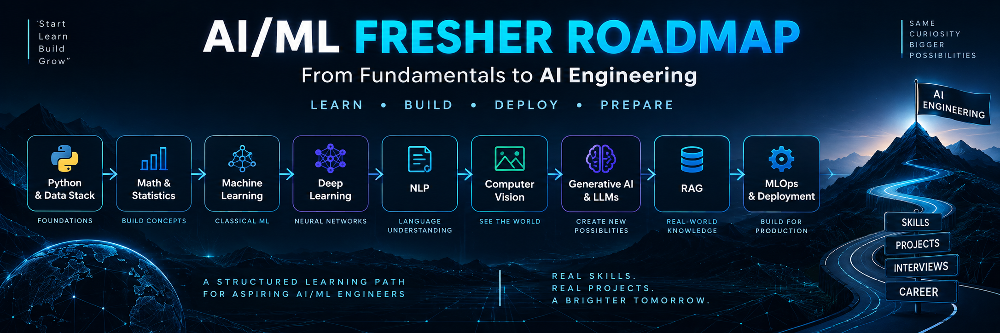

# AI/ML Fresher Roadmap

### From Python Fundamentals to AI Engineering

A structured, practical learning path for aspiring AI/ML engineers.

Learn the fundamentals. Build real projects.
Understand modern Generative AI. Prepare for interviews.

Python • SQL • Machine Learning • Deep Learning • NLP • Computer Vision
Generative AI • LLMs • RAG • AI Agents • MCP • MLOps • Cloud

---

## What You Will Learn

```mermaid
flowchart LR
    A[Python, SQL & Data] --> B[Math & Statistics]
    B --> C[Classical ML, Time Series & RecSys]
    C --> D[Deep Learning & RL]
    D --> E[NLP & Computer Vision]
    E --> F[Advanced RAG, LLMs & Serving]
    F --> G[AI Agents Fundamentals]
    G --> H[Tools & Orchestration]
    H --> I[Multi-Agent & MCP]
    I --> J[Agent Evaluation & Safety]
    J --> K[MLOps, Drift, Feature Stores & Cloud]
    K --> L[Scenarios & Interview Kits]
```

---

## Modules

### [01 — Python & Data Stack](./01_python_and_data_stack.md)
Build the programming, database, and data engineering foundations required for ML.  
`Python` `NumPy` `Pandas` `SQL` `ETL Foundations` `Data Cleaning`

### [02 — Math & Statistics](./02_math_and_statistics.md)
Understand the mathematical and statistical intuition behind ML algorithms.  
`Vectors` `Linear Algebra` `Probability` `Descriptive & Inferential Stats` `Cosine Similarity`

### [03 — Classical Machine Learning & Recommendation Systems](./03_classical_machine_learning.md)
Learn the core algorithms of traditional AI, forecasting, recommendation architectures, and ethics.  
`Classification` `Regression` `Decision Trees` `Ensembles` `Time Series` `Recommendation Systems (Two-Tower/NDCG)` `AI Ethics`

### [04 — Deep Learning Fundamentals](./04_deep_learning_fundamentals.md)
Understand how neural networks learn, optimize, and make sequential decisions.  
`Neural Networks` `Gradient Descent` `Backpropagation` `Loss Functions` `PyTorch` `Reinforcement Learning`

### [05 — NLP & Computer Vision](./05_nlp_and_computer_vision.md)
Specialized techniques for text, sequence, and image data.  
`Tokens` `Transformers` `CNNs` `Transfer Learning` `Object Detection` `Vision-Language Models`

### [06 — Generative AI, LLMs & Advanced RAG](./06_genai_llms_and_rag.md)
The most in-demand AI skills today, from prompt engineering to low-latency LLM serving.  
`LLMs` `Prompting` `Hybrid Search (BM25 + Dense)` `Cross-Encoder Rerank` `RAGAS` `KV Cache & vLLM`

### [07 — AI Agents Fundamentals](./07_ai_agents_fundamentals.md)
Understand the difference between an LLM and an autonomous Agent.  
`ReAct Loop` `Agent Architecture` `Working Memory` `Goal Planning`

### [08 — Tools, Function Calling & Orchestration](./08_tools_and_orchestration.md)
Learn how agents interact with APIs, databases, and the outside world.  
`Function Calling` `Tool Schemas` `LangGraph` `Google ADK` `Human-in-the-Loop`

### [09 — Multi-Agent Systems & MCP](./09_multi_agent_systems_and_mcp.md)
Collaborative multi-agent workflows and standardized tool integration.  
`CrewAI` `AutoGen` `Google ADK Subagents` `Model Context Protocol (MCP)`

### [10 — Agent Evaluation, Safety & Production](./10_agent_evaluation_and_safety.md)
Building safe, reliable, and observable agentic systems.  
`LLM-as-a-Judge` `Tracing & Observability` `Prompt Injection` `Guardrails`

### [11 — MLOps & AI Engineering](./11_mlops_and_ai_engineering.md)
Learn how to package, track, deploy, monitor, and A/B test models in production and cloud.  
`FastAPI` `Docker` `MLflow` `DVC` `Feature Stores (Feast)` `Drift Detection (PSI)` `A/B Testing` `Cloud (AWS/GCP)`

### [12 — Practical Scenarios & Coding](./12_practical_scenarios_and_coding.md)
Hands-on coding exercises, edge cases, and real-world system debugging.  
`Data Leakage` `Preprocessing` `Imbalanced Data` `Distribution Shift` `System Thinking`

---

## Interview Preparation & Practice Kits

Prepare for technical screenings, take-home assignments, and system design interviews:

| Kit | Focus Areas | Link |
|---|---|---|
| **Classical ML Interview Kit** | Core ML intuition, bias-variance, RecSys, drift diagnosis, A/B testing | [Open ML Questions →](./interview/ml_questions.md) |
| **Generative AI & Agent Kit** | Advanced RAG, RAGAS, TTFT/TPOT, KV Cache, vLLM, agents, safety | [Open GenAI Questions →](./interview/genai_questions.md) |
| **Coding & Algorithms Practice** | Vectorized NumPy/Pandas, custom ML algorithms, coding traps | [Open Coding Questions →](./interview/coding_questions.md) |

---

## Curated Resources & Study Materials

Looking for deeper theoretical or practical references? Check out our hand-picked collection of books, courses, and engineering blogs:
- **[Recommended Resources Guide →](./resources/recommended_resources.md)**

---

## Real-World AI/ML Portfolio Projects (Local & Cloud Mix)

A winning portfolio demonstrates that you can build **both locally on consumer hardware ($0 cloud spend)** and **at scale across cloud environments (AWS, GCP, Big Tech)**:

### 💻 Track 1: 100% Local Projects ($0 Cloud Cost — Run on Laptop)
| Project | Problem Solved & Local Architecture | Key Local Stack | Detailed Blueprint |
|---|---|---|---|
| **Private Desktop AI Copilot** | Air-gapped offline assistant: local GGUF quantization, embedded in-memory vector store, and DuckDB SQL engine. | Ollama, Llama 3.2, ChromaDB, DuckDB, LangGraph | [View Local Blueprint →](./PROJECTS.md#-local-project-1-private-air-gapped-desktop-rag--multi-tool-agent) |
| **Real-Time Edge CV Tracker** | Multi-threaded edge video stream analytics, live footfall counting, and vehicle tracking at 45+ FPS with zero cloud latency. | YOLOv11, DeepSORT, OpenCV, FastAPI, PyTorch | [View Local Blueprint →](./PROJECTS.md#-local-project-2-real-time-edge-computer-vision--multi-object-tracking-pipeline) |
| **Autograd Engine & Transformer** | Built from scratch in pure Python/NumPy: reverse-mode autodiff, multi-head self-attention, and training on CPU. | Pure Python, NumPy (Zero ML libraries) | [View Local Blueprint →](./PROJECTS.md#-local-project-3-autograd-engine--character-level-transformer-from-scratch) |
| **Full-Lifecycle Local MLOps** | Complete ML lifecycle: Bayesian tuning (Optuna), local experiment tracking (MLflow + SQLite), Dockerized FastAPI, and Pytest. | Scikit-Learn, MLflow, Optuna, Docker, FastAPI | [View Local Blueprint →](./PROJECTS.md#-local-project-4-full-lifecycle-local-mlops-pipeline-with-mlflow-optuna--docker) |

### ☁️ Track 2: Cloud & Big Tech Enterprise Projects
| Cloud / Big Tech Target | Problem Solved & Cloud Architecture | Key Cloud Stack | Detailed Blueprint |
|---|---|---|---|
| **AWS (Bedrock / Textract)** | **Serverless IDP Pipeline:** End-to-end event-driven invoice/contract parsing with automated PII masking and vector audit. | Amazon Bedrock, Textract, Comprehend, OpenSearch, Lambda | [View Cloud Blueprint →](./PROJECTS.md#️-project-5-aws-enterprise-serverless-intelligent-document-processing-idp-pipeline) |
| **GCP (Vertex AI / BigQuery)** | **Multimodal Video Intelligence Engine:** Natural language search across petabytes of video footage with sub-100ms vector lookup. | Vertex AI Multimodal Embeddings, BigQuery Vector Search, Gemini | [View Cloud Blueprint →](./PROJECTS.md#️-project-6-gcp-enterprise-multimodal-video-intelligence--semantic-search-engine) |
| **Google Cloud (Google ADK)** | **Autonomous Operations Copilot:** Code-first multi-agent supervisor delegating to specialized subagents with Model Context Protocol (MCP). | Google ADK (`google-adk`), FastMCP, Gemini, Cloud Run | [View Cloud Blueprint →](./PROJECTS.md#-project-7-google-ecosystem-autonomous-operations--support-copilot-with-google-adk--mcp) |
| **Meta & Amazon** | **Two-Stage E-Commerce Recommendation Engine:** Real-time candidate retrieval (Two-Tower embeddings + FAISS HNSW) + LightGBM ranking (<40ms SLA). | PyTorch, FAISS, LightGBM, Redis, FastAPI | [View Cloud Blueprint →](./PROJECTS.md#-project-8-meta--amazon-two-stage-e-commerce-recommendation--ranking-engine) |
| **Stripe / FinTech / AWS** | **Real-Time Fraud Prevention Pipeline:** Handling extreme class imbalance (<0.1% fraud), Feast Feature Store, and Evidently drift-triggered CI/CD. | Feast, XGBoost, Evidently AI, MLflow, AWS Kinesis | [View Cloud Blueprint →](./PROJECTS.md#️-project-9-fintech--stripe--aws-real-time-fraud-prevention-with-feature-store--drift-monitoring) |
| **AI Infrastructure** | **Low-Latency LLM Serving Engine:** High-throughput serving via vLLM (PagedAttention), 2-tier semantic caching, and OpenTelemetry tracing. | vLLM, Redis, OpenTelemetry, Phoenix, PyTorch | [View Cloud Blueprint →](./PROJECTS.md#-project-10-ai-infrastructure-high-throughput-enterprise-llm-serving-with-vllm--semantic-caching) |

> 📖 **Full Implementation Guides & Resume CAR Bullet Points:** See the complete blueprints in **[PROJECTS.md](./PROJECTS.md)**.

---

## Recommended 6-Week Study Plan

| Week | Focus | Core Modules & Resources |
|---|---|---|
| **Week 1** | Python, SQL & Math Foundations | [Module 01 (Python & Data)](./01_python_and_data_stack.md) • [Module 02 (Math & Stats)](./02_math_and_statistics.md) |
| **Week 2** | Classical ML, RecSys & Deep Learning | [Module 03 (Classical ML & RecSys)](./03_classical_machine_learning.md) • [Module 04 (Deep Learning)](./04_deep_learning_fundamentals.md) |
| **Week 3** | NLP, Computer Vision & Production GenAI | [Module 05 (NLP & CV)](./05_nlp_and_computer_vision.md) • [Module 06 (GenAI & Advanced RAG)](./06_genai_llms_and_rag.md) |
| **Week 4** | Autonomous Agents & Orchestration | [Module 07 (Agent Fundamentals)](./07_ai_agents_fundamentals.md) • [Module 08 (Tools & LangGraph)](./08_tools_and_orchestration.md) |
| **Week 5** | Multi-Agent Systems, MCP & Evaluation | [Module 09 (Multi-Agent & MCP)](./09_multi_agent_systems_and_mcp.md) • [Module 10 (Evals & Safety)](./10_agent_evaluation_and_safety.md) |
| **Week 6** | Production MLOps & Interview Mastery | [Module 11 (MLOps & Cloud)](./11_mlops_and_ai_engineering.md) • [Module 12 (Scenarios)](./12_practical_scenarios_and_coding.md) • [Interview Kits](./interview/ml_questions.md) |

---

## Progress Checklist

Track your completion through the 12 core roadmap milestones:

- [ ] **Milestone 01:** Python, NumPy, Pandas, SQL joins & ETL pipelines
- [ ] **Milestone 02:** Linear algebra, probability distributions & hypothesis testing
- [ ] **Milestone 03:** Supervised ML, Ensembles, Time Series, RecSys (Two-Tower/NDCG) & Ethics
- [ ] **Milestone 04:** Neural networks, Backprop, PyTorch, Optimizers & Reinforcement Learning
- [ ] **Milestone 05:** Tokenizers, Transformers, CNNs & Vision-Language models
- [ ] **Milestone 06:** LLM architectures, Advanced RAG (Hybrid/Rerank), RAGAS & vLLM serving
- [ ] **Milestone 07:** AI Agent loops, ReAct architecture, working memory & planning
- [ ] **Milestone 08:** Function calling schemas, LangGraph & Google ADK orchestration
- [ ] **Milestone 09:** Multi-Agent collaboration (CrewAI, AutoGen, Google ADK) & Model Context Protocol (MCP)
- [ ] **Milestone 10:** LLM-as-a-judge, Tracing (LangSmith), Prompt Injection & Guardrails
- [ ] **Milestone 11:** FastAPI model serving, Docker, MLflow, DVC, Feature Stores & Cloud (AWS/GCP)
- [ ] **Milestone 12:** Debugging data leakage, production shifts & interview question kits

---

## Interview Tips for Freshers

### How to Structure Your Answer
When you don't know the complete answer, don't panic:
1. **Start with what you know.** Give the basic definition first.
2. **Explain the intuition.** Use a simple analogy or example (*"Think of it like..."*).
3. **Give a practical example.** Connect the concept to a real-world ML problem.
4. **Be honest about your experience.** For example: *"I understand the concept, but I haven't implemented it in production yet."*
5. **Go deeper if the interviewer asks.** Don't start with advanced mathematics unless the interviewer asks for it.

### Common Mistakes to Avoid
- Saying "99% accuracy" without checking class imbalance.
- Preprocessing the entire dataset before splitting when that causes data leakage.
- Using a complex model before establishing a simple baseline.
- Confusing parameters and hyperparameters.
- Confusing tokens with embeddings.
- Saying every image is simply converted into text tokens.
- Saying RAG completely eliminates hallucinations.
- Saying fine-tuning is always better than RAG.
- Memorizing formulas without understanding what they mean.
- Not asking clarifying questions for an open-ended ML problem.

---

## Quick Revision Flashcards

| Term | 1-Line Definition |
|------|-------------------|
| **AI** | A broad field focused on building systems that perform tasks requiring capabilities associated with human intelligence. |
| **ML** | A subset of AI where models learn patterns from data. |
| **Deep Learning** | ML based on neural networks with multiple layers. |
| **LLM** | A large language model trained to understand and generate language, typically using tokenized text during training and inference. |
| **Token** | A unit of text produced by a tokenizer; it may be a word, subword, punctuation mark, or another text fragment. |
| **Prompt** | The input instruction or context provided to a generative AI model. |
| **Embedding** | A numerical vector representation designed to capture useful semantic relationships in data. |
| **Hallucination** | When a generative AI model produces information that is incorrect, unsupported, or fabricated. |
| **RAG** | Retrieval-Augmented Generation: retrieving relevant external information and providing it to a model as context for generation. |
| **Vector Database** | A database designed to store and efficiently search vector representations, commonly using similarity search. |
| **AI Agent** | An autonomous LLM-powered entity that observes, reasons, and executes actions using tools and memory to achieve goals. |
| **MCP** | Model Context Protocol: an open standard for securely connecting AI assistants to data sources and execution tools. |
| **Reinforcement Learning** | An ML paradigm where an agent learns decision policies through trial-and-error rewards and penalties. |
| **Semantic Search** | Search based on meaning or similarity rather than only exact keyword matching. |
| **Overfitting** | When a model fits training data too closely and performs poorly on unseen data. |
| **Recall** | Of all actual positive cases, the proportion correctly identified as positive. |
| **Precision** | Of all predicted positive cases, the proportion that are actually positive. |
| **F1-Score** | The harmonic mean of Precision and Recall. |
| **Transfer Learning** | Reusing knowledge from a pretrained model for another task. |
| **Gradient Descent** | An optimization method that iteratively updates model parameters to reduce a loss function. |
| **Epoch** | One complete pass through the training dataset. |
| **Batch Size** | The number of training samples processed before a parameter update. |
| **Dropout** | Randomly disabling some neural network units during training to help reduce overfitting. |
| **Docker** | A technology for packaging applications and dependencies into portable containers. |
| **DVC** | Data Version Control: an open-source tool for tracking datasets, model files, and pipelines alongside Git. |
| **Data Leakage** | When information from outside the training process improperly influences model training. |
| **Fine-Tuning** | Further training a pretrained model on a task- or domain-specific dataset. |
| **Context Window** | The amount of input/output context a model can handle within a given interaction, subject to model limits. |
| **Quantization** | Representing model parameters or computations with lower numerical precision to reduce memory and speed inference. |
| **Data Drift** | Change in the statistical distribution of input features between training baseline and live production data. |
| **Concept Drift** | Change in the statistical relationship between input features and target labels, degrading model accuracy. |
| **Feature Store** | Centralized platform providing consistent feature calculations and point-in-time correctness across training and inference. |
| **Two-Tower Model** | An architecture with separate user and item encoders mapped to a shared embedding space for low-latency retrieval. |
| **NDCG@K** | Normalized Discounted Cumulative Gain: a ranking metric measuring whether relevant items appear at the top of recommendations. |
| **vLLM** | A high-throughput, low-latency LLM serving engine powered by PagedAttention for non-contiguous KV cache memory allocation. |

---

## Start Here

- **If you are completely new to AI/ML:** Start at **[Module 01](./01_python_and_data_stack.md)** and follow the **6-Week Study Plan** sequentially.
- **If you already have ML experience:** Jump straight to **[Module 06 (GenAI & RAG)](./06_genai_llms_and_rag.md)** or **[Module 07 (AI Agents)](./07_ai_agents_fundamentals.md)** and drill the **[Interview Kits](./interview/ml_questions.md)**.

> **The goal is not to memorize everything.** Understand the fundamentals well enough to explain them, implement them, and reason about trade-offs.
