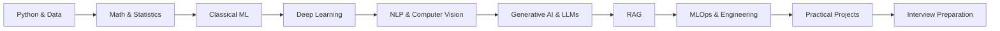
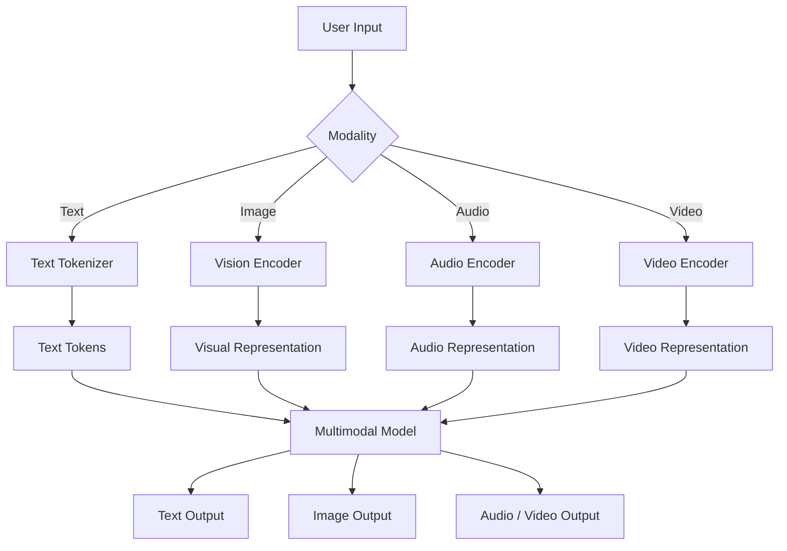
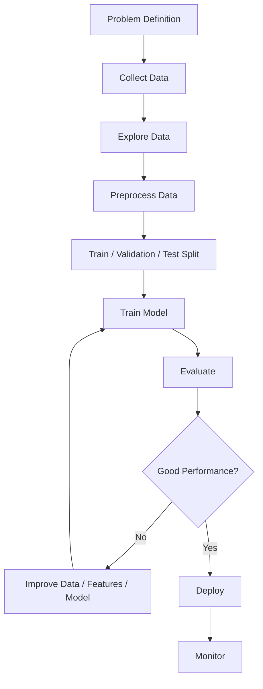
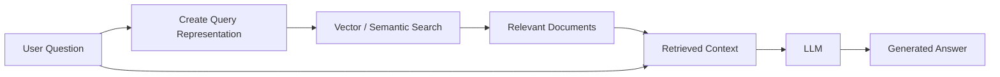

# AI/ML Fresher Roadmap

## Trainee AI/ML Engineer — Fresher Interview Preparation Guide

Welcome! 

This repository is a structured interview preparation and learning guide for freshers and trainees applying for **AI/ML Engineering roles**.

**Positioning:** Fresher → AI/ML Engineer → Interview → Practical Implementation → Production

The roadmap follows this practical approach:
Learn
  ↓
Understand
  ↓
Code
  ↓
Build
  ↓
Deploy
  ↓
Explain in Interview

The material is intentionally written in a simple, practical way, focusing on quality, completeness, projects, documentation, and visibility.

---

## Learning Path



---


## Prerequisites

You don't need advanced mathematics or prior ML experience.

Recommended:

- Basic Python programming
- Basic understanding of functions and data structures
- Basic Git/GitHub knowledge
- Willingness to practice coding

Mathematics and ML concepts are introduced progressively.


## Progress Tracker

### Foundations

- [ ] Python & Data Stack
- [ ] Math & Statistics

### Machine Learning

- [ ] Classical Machine Learning
- [ ] Deep Learning
- [ ] NLP & Computer Vision

### Generative AI

- [ ] LLM Fundamentals
- [ ] Prompt Engineering
- [ ] Embeddings
- [ ] RAG
- [ ] Fine-Tuning

### Engineering

- [ ] APIs
- [ ] Docker
- [ ] MLflow
- [ ] CI/CD
- [ ] Deployment

### Projects

- [ ] Classical ML Project
- [ ] Computer Vision Project
- [ ] RAG Project
- [ ] LLM Application
- [ ] Deployment Project

## Complete Module Index

| # | Module | Topics | Difficulty |
|---|--------|--------|:----------:|
| 1 | [01. Python & Data Stack](./01_python_and_data_stack.md) | Python basics, Lists vs Tuples, NumPy arrays, Pandas DataFrames, handling NaN | Beginner |
| 2 | [02. Math & Statistics](./02_math_and_statistics.md) | Vectors, Dot Product, Cosine Similarity, Mean/Median, Correlation, Probability, Normal Distribution, p-value | Beginner |
| 3 | [03. Classical Machine Learning](./03_classical_machine_learning.md) | AI vs ML, Supervised vs Unsupervised Learning, Classification vs Regression, Linear/Logistic Regression, Decision Trees, Random Forest, Confusion Matrix, Accuracy/Precision/Recall/F1 | Beginner |
| 4 | [04. Deep Learning Fundamentals](./04_deep_learning_fundamentals.md) | Neural Networks, Neurons, Layers, Activation Functions, Loss Functions, Gradient Descent, Backpropagation, Dropout, Overfitting, Epoch/Batch/Iteration | Intermediate |
| 5 | [05. NLP & Computer Vision](./05_nlp_and_computer_vision.md) | NLP, Tokens & Tokenization, Embeddings, Sentiment Analysis, NER, CNNs, Transfer Learning, BoW, TF-IDF, Image Classification, Object Detection, Segmentation | Intermediate |
| 6 | [06. Generative AI, LLMs & RAG](./06_genai_llms_and_rag.md) | Generative AI, LLMs, Text Tokens, Prompting, Hallucination, RAG, Vector Databases, Embeddings, Fine-Tuning vs RAG, Context Window, Quantization | Must Know |
| 7 | [07. MLOps & Engineering](./07_mlops_and_engineering_practices.md) | MLOps, FastAPI, Docker, Git, MLflow, Data Drift, CI/CD, Model Deployment | Intermediate |
| 8 | [08. Practical Scenarios & Coding](./08_practical_scenarios_and_coding.md) | ML problem-solving, data leakage, missing data, model evaluation, coding exercises, metrics from scratch, Pandas cleaning, LLM API integration | Practical |

---

## Most Important Topics for Fresher AI/ML Interviews

These are the concepts you should be able to explain clearly in your own words, not just memorize definitions.

### Tier 1 — Must Know
- [ ] What is AI, ML, and Deep Learning? What's the difference?
- [ ] What is Supervised vs Unsupervised vs Reinforcement Learning?
- [ ] What is Classification vs Regression? Give examples.
- [ ] What is Overfitting? How do you fix it?
- [ ] What is a Confusion Matrix? Explain TP, TN, FP, FN.
- [ ] What are Precision, Recall, and F1-Score? When should you prefer each?
- [ ] What is a Neural Network?
- [ ] What is Gradient Descent?
- [ ] What is Backpropagation?
- [ ] What is Generative AI?
- [ ] What is an LLM? Give examples.
- [ ] What is a Token?
- [ ] What is Tokenization? Why are subword tokens used?
- [ ] What is a Prompt and Prompt Engineering?
- [ ] What is Hallucination in an LLM?
- [ ] What is RAG?
- [ ] What is an Embedding?

### Tier 2 — Good to Know
- [ ] What is Random Forest and why can it outperform a single Decision Tree?
- [ ] What is Train-Test Split? Why is it necessary?
- [ ] What is Data Leakage?
- [ ] What is the difference between L1 and L2 Regularization?
- [ ] What is Transfer Learning?
- [ ] What is a CNN?
- [ ] What is Word Embedding / Word2Vec?
- [ ] What is a Vector Database?
- [ ] What is Semantic Search?
- [ ] What is Docker and why is it used?
- [ ] What is an API?
- [ ] What is Model Deployment?

### Tier 3 — Advanced / Strong Candidates
- [ ] What is the Bias-Variance Tradeoff?
- [ ] What is the Transformer architecture?
- [ ] What is Self-Attention?
- [ ] What is the difference between Encoder and Decoder architectures?
- [ ] BERT vs GPT — what's the difference?
- [ ] What is Fine-Tuning?
- [ ] Fine-Tuning vs RAG — when would you use each?
- [ ] What is Quantization?
- [ ] What is MLflow?
- [ ] What is Data Drift?
- [ ] What is CI/CD for ML?
- [ ] What are multimodal AI models?
- [ ] What is an AI Agent?

---

## Important Concept: Token vs Embedding vs Representation

One of the most common areas of confusion for beginners is treating tokens, embeddings, and model representations as the same thing.

**They are not.**

### Text
```text
"I love machine learning"
      │
    Tokenizer
      │
["I", "love", "machine", "learning"]
      │
  Model representation
      │
  Numerical vectors
```
- A **token** is a unit of text produced by a tokenizer.
- A token can represent a complete word, part of a word, punctuation, or another piece of text.

For example:
```text
"unhappiness"
   │
["un", "happi", "ness"]
```
*(These are subword tokens)*

### Embedding
An **embedding** is a vector of numbers designed to represent useful properties or relationships of data.

```text
"machine learning"
    │
 Embedding model
    │
[0.21, -0.73, 0.45, 0.18, ...]
```

### Image
Images are processed differently:

```text
Image
 │
Vision Encoder / Image Processor
 │
Image patches / visual representations
 │
Numerical representation
```

A multimodal model may internally use visual tokens, but these are not the same thing as text subword tokens.

> [!NOTE] 
> **Remember:** Token ≠ Embedding ≠ Feature

---

## Multimodal AI

Different modalities can be processed using different representations.



### The Important Takeaway:
- **Text** is commonly represented using text tokens.
- **Other modalities** use model-specific representations, which may sometimes also be called tokens.
- A generated image is therefore **not** necessarily a sequence of text tokens. An image-generation system uses its own image-generation and decoding process (such as diffusion or autoregressive patch modeling).

---

## Typical Machine Learning Workflow



---

## RAG Workflow (Retrieval-Augmented Generation)



---

## Recommended 4-Week Study Plan

### Week 1 — Python + Math Foundations
- **Days 1–3: [Module 01 - Python & Data Stack](./01_python_and_data_stack.md)**
 - Focus on: Python fundamentals, Lists, tuples, dictionaries, NumPy, Pandas, Missing values
- **Days 4–7: [Module 02 - Math & Statistics](./02_math_and_statistics.md)**
 - Focus on: Vectors, Dot Product, Cosine Similarity, Probability, Mean/Median, Correlation, Normal Distribution, Basic hypothesis testing

### Week 2 — Classical Machine Learning
- **Days 1–4: [Module 03 - Classical Machine Learning](./03_classical_machine_learning.md)**
 - Focus especially on: Classification vs Regression, Train/Test Split, Overfitting, Confusion Matrix, Precision, Recall, F1-Score, Decision Trees, Random Forest
- **Days 5–7: Practice building models with Scikit-learn using beginner-friendly datasets.**

### Week 3 — Deep Learning + NLP + Computer Vision
- **Days 1–4: [Module 04 - Deep Learning Fundamentals](./04_deep_learning_fundamentals.md)**
 - Learn: Neural Networks, Neurons, Activation Functions, Loss Functions, Gradient Descent, Backpropagation, Epochs, Batches, Overfitting, Dropout
- **Days 5–7: [Module 05 - NLP & Computer Vision](./05_nlp_and_computer_vision.md)**
 - Learn: Tokenization, Subword tokens, Embeddings, Sentiment Analysis, NER, CNNs, Transfer Learning, Image Classification, Object Detection, Segmentation

### Week 4 — GenAI + RAG + MLOps + Practice
- **Days 1–3: [Module 06 - Generative AI, LLMs & RAG](./06_genai_llms_and_rag.md) **
 - Focus on: Generative AI, LLMs, Tokens, Prompt Engineering, Hallucination, Embeddings, Vector Search, RAG, Context Windows, Fine-Tuning, Quantization
- **Days 4–5: [Module 07 - MLOps & Engineering](./07_mlops_and_engineering_practices.md)**
 - Focus on: APIs, FastAPI, Docker, Git, MLflow, Deployment, Data Drift, CI/CD
- **Days 6–7: [Module 08 - Practical Scenarios & Coding](./08_practical_scenarios_and_coding.md)**
 - Practice: ML problem-solving, Coding, Data preprocessing, Metrics, Model evaluation, LLM API integration

---


## Practical Projects

- **Project 1 — Classical ML:** Customer Churn Prediction
- **Project 2 — Computer Vision:** Image Classification / Defect Detection
- **Project 3 — NLP:** Sentiment Analysis
- **Project 4 — RAG:** PDF Question Answering System
- **Project 5 — GenAI:** LLM-powered AI Assistant
- **Project 6 — MLOps:** Deploy an ML model with FastAPI + Docker

## Interview Tips for Freshers

### How to Structure Your Answer
When you don't know the complete answer, don't panic.
1. **Start with what you know.** 
  Give the basic definition first.
2. **Explain the intuition.** 
  Use a simple analogy or example (*"Think of it like..."*).
3. **Give a practical example.** 
  Connect the concept to a real-world ML problem.
4. **Be honest about your experience.** 
  For example: *"I understand the concept, but I haven't implemented it in production yet."*
5. **Go deeper if the interviewer asks.** 
  Don't start with advanced mathematics unless the interviewer asks for it.

### Common Mistakes to Avoid
- Saying "99% accuracy" without checking class imbalance.
- Preprocessing the entire dataset before splitting when that causes data leakage.
- Using a complex model before establishing a simple baseline.
- Confusing parameters and hyperparameters.
- Confusing tokens with embeddings.
- Saying every image is simply converted into text tokens.
- Saying RAG completely eliminates hallucinations.
- Saying fine-tuning is always better than RAG.
- Memorizing formulas without understanding what they mean.
- Not asking clarifying questions for an open-ended ML problem.

---

## Quick Revision Flashcards

| Term | 1-Line Definition |
|------|-------------------|
| **AI** | A broad field focused on building systems that perform tasks requiring capabilities associated with human intelligence. |
| **ML** | A subset of AI where models learn patterns from data. |
| **Deep Learning** | ML based on neural networks with multiple layers. |
| **LLM** | A large language model trained to understand and generate language, typically using tokenized text during training and inference. |
| **Token** | A unit of text produced by a tokenizer; it may be a word, subword, punctuation mark, or another text fragment. |
| **Subword Token** | A token representing part of a word, such as *un*, *happi*, or *ness*. |
| **Prompt** | The input instruction or context provided to a generative AI model. |
| **Embedding** | A numerical vector representation designed to capture useful relationships in data. |
| **Hallucination** | When a generative AI model produces information that is incorrect, unsupported, or fabricated. |
| **RAG** | Retrieval-Augmented Generation: retrieving relevant external information and providing it to a model as context for generation. |
| **Vector Database** | A database designed to store and efficiently search vector representations, commonly using similarity search. |
| **Semantic Search** | Search based on meaning or similarity rather than only exact keyword matching. |
| **Overfitting** | When a model fits training data too closely and performs poorly on unseen data. |
| **Recall** | Of all actual positive cases, the proportion correctly identified as positive. |
| **Precision** | Of all predicted positive cases, the proportion that are actually positive. |
| **F1-Score** | The harmonic mean of Precision and Recall. |
| **Transfer Learning** | Reusing knowledge from a pretrained model for another task. |
| **Gradient Descent** | An optimization method that iteratively updates model parameters to reduce a loss function. |
| **Epoch** | One complete pass through the training dataset. |
| **Batch Size** | The number of training samples processed before a parameter update. |
| **Dropout** | Randomly disabling some neural network units during training to help reduce overfitting. |
| **Docker** | A technology for packaging applications and dependencies into portable containers. |
| **Data Leakage** | When information from outside the training process improperly influences model training. |
| **Fine-Tuning** | Further training a pretrained model on a task- or domain-specific dataset. |
| **Context Window** | The amount of input/output context a model can handle within a given interaction, subject to the model's limits. |
| **Quantization** | Representing model parameters or computations with lower numerical precision to reduce memory and/or improve efficiency. |

---

## Final Goal

By the end of this roadmap, you should be able to:

```mermaid
flowchart LR
    A["AI/ML Fundamentals"] --> B[Python & Data]
    B --> C[ML Models]
    C --> D[Deep Learning]
    D --> E["NLP & Computer Vision"]
    E --> F["LLMs & Generative AI"]
    F --> G[RAG Applications]
    G --> H[MLOps & Deployment]
    H --> I[Practical Problem Solving]
    I --> J[Interview Ready]
```



> **The goal is not to memorize everything.** 
> The goal is to understand the fundamentals well enough to explain them, implement them, and reason about when to use them.

---

## Start Here

- **If you're completely new to AI/ML:** 
 `Python` → `Math` → `Classical ML` → `Deep Learning` → `NLP/CV` → `GenAI/RAG` → `MLOps` → `Practical Projects`

- **If you already know Python and basic ML:** 
 `Deep Learning` → `NLP/CV` → `GenAI/RAG` → `MLOps` → `Projects` → `Interview Practice`
