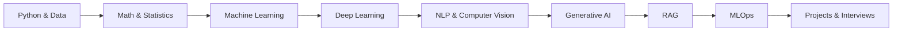

# AI/ML Fresher Roadmap

### From Python Fundamentals to AI Engineering

A structured, practical learning path for aspiring AI/ML engineers.

Learn the fundamentals. Build real projects.
Understand modern Generative AI. Prepare for interviews.

Python • Machine Learning • Deep Learning • NLP • Computer Vision
Generative AI • LLMs • RAG • MLOps

---

## Roadmap at a Glance

FOUNDATIONS
Python → Math & Statistics

             ↓

MACHINE LEARNING
Classical ML → Deep Learning

             ↓

AI SPECIALIZATION
NLP → Computer Vision

             ↓

GENERATIVE AI
LLMs → Prompting → Embeddings → RAG

             ↓

ENGINEERING
APIs → Docker → MLflow → CI/CD

             ↓

CAREER READY
Projects → Coding → System Thinking → Interviews

---

## What You Will Learn

---

## Modules

### 01 — Python & Data Stack
Build the programming and data foundations required for ML.
`Python` `NumPy` `Pandas` `Data Cleaning`
[Start Module →](./01_python_and_data_stack.md)

### 02 — Math & Statistics
Understand the mathematical intuition behind ML.
`Vectors` `Probability` `Statistics` `Cosine Similarity`
[Start Module →](./02_math_and_statistics.md)

### 03 — Classical Machine Learning
Learn the core algorithms of traditional AI.
`Classification` `Regression` `Decision Trees` `Random Forest` `Evaluation Metrics`
[Start Module →](./03_classical_machine_learning.md)

### 04 — Deep Learning Fundamentals
Understand how neural networks learn.
`Neural Networks` `Gradient Descent` `Backpropagation` `Loss Functions`
[Start Module →](./04_deep_learning_fundamentals.md)

### 05 — NLP & Computer Vision
Specialized techniques for text and image data.
`Tokens` `CNNs` `Transfer Learning` `Object Detection`
[Start Module →](./05_nlp_and_computer_vision.md)

### 06 — Generative AI, LLMs & RAG
The most in-demand AI skills today.
`LLMs` `Prompting` `Embeddings` `RAG` `Fine-Tuning`
[Start Module →](./06_genai_llms_and_rag.md)

### 07 — MLOps & Engineering
Learn how to deploy and manage models in production.
`APIs` `FastAPI` `Docker` `MLflow` `CI/CD`
[Start Module →](./07_mlops_and_engineering_practices.md)

### 08 — Practical Scenarios & Coding
Hands-on coding exercises and real-world problem solving.
`Data Leakage` `Preprocessing` `Model Evaluation` `System Thinking`
[Start Module →](./08_practical_scenarios_and_coding.md)

---

## What You'll Build

| Project | Skills |
|---|---|
| Customer Churn Predictor | Classical ML |
| Image Classifier | CNN / Transfer Learning |
| Sentiment Analyzer | NLP |
| PDF RAG Assistant | Embeddings / Vector Search / LLM |
| AI Assistant | LLM / Prompt Engineering |
| ML API | FastAPI / Docker |

---

## Who Is This For?

This roadmap is designed for:
- Students starting AI/ML
- Fresh graduates
- Trainee AI/ML Engineers
- Developers transitioning into AI/ML
- Candidates preparing for AI/ML interviews

No advanced ML experience is required.

---

## Progress

### Foundations
- [ ] Python & Data
- [ ] Math & Statistics

### Machine Learning
- [ ] Classical ML
- [ ] Deep Learning
- [ ] NLP & Computer Vision

### Generative AI
- [ ] LLM Fundamentals
- [ ] Prompt Engineering
- [ ] Embeddings
- [ ] RAG
- [ ] Fine-Tuning

### Engineering
- [ ] APIs
- [ ] Docker
- [ ] MLflow
- [ ] CI/CD
- [ ] Deployment

### Projects
- [ ] ML Project
- [ ] Computer Vision Project
- [ ] RAG Project
- [ ] LLM Application

---

## Recommended 4-Week Study Plan

### Week 1 — Python + Math Foundations
- **Days 1–3: [Module 01 - Python & Data Stack](./01_python_and_data_stack.md)**
  - Focus on: Python fundamentals, Lists, tuples, dictionaries, NumPy, Pandas, Missing values
- **Days 4–7: [Module 02 - Math & Statistics](./02_math_and_statistics.md)**
  - Focus on: Vectors, Dot Product, Cosine Similarity, Probability, Mean/Median, Correlation, Normal Distribution, Basic hypothesis testing

### Week 2 — Classical Machine Learning
- **Days 1–4: [Module 03 - Classical Machine Learning](./03_classical_machine_learning.md)**
  - Focus especially on: Classification vs Regression, Train/Test Split, Overfitting, Confusion Matrix, Precision, Recall, F1-Score, Decision Trees, Random Forest
- **Days 5–7: Practice building models with Scikit-learn using beginner-friendly datasets.**

### Week 3 — Deep Learning + NLP + Computer Vision
- **Days 1–4: [Module 04 - Deep Learning Fundamentals](./04_deep_learning_fundamentals.md)**
  - Learn: Neural Networks, Neurons, Activation Functions, Loss Functions, Gradient Descent, Backpropagation, Epochs, Batches, Overfitting, Dropout
- **Days 5–7: [Module 05 - NLP & Computer Vision](./05_nlp_and_computer_vision.md)**
  - Learn: Tokenization, Subword tokens, Embeddings, Sentiment Analysis, NER, CNNs, Transfer Learning, Image Classification, Object Detection, Segmentation

### Week 4 — GenAI + RAG + MLOps + Practice
- **Days 1–3: [Module 06 - Generative AI, LLMs & RAG](./06_genai_llms_and_rag.md)**
  - Focus on: Generative AI, LLMs, Tokens, Prompt Engineering, Hallucination, Embeddings, Vector Search, RAG, Context Windows, Fine-Tuning, Quantization
- **Days 4–5: [Module 07 - MLOps & Engineering](./07_mlops_and_engineering_practices.md)**
  - Focus on: APIs, FastAPI, Docker, Git, MLflow, Deployment, Data Drift, CI/CD
- **Days 6–7: [Module 08 - Practical Scenarios & Coding](./08_practical_scenarios_and_coding.md)**
  - Practice: ML problem-solving, Coding, Data preprocessing, Metrics, Model evaluation, LLM API integration

---

## Interview Tips for Freshers

### How to Structure Your Answer
When you don't know the complete answer, don't panic.
1. **Start with what you know.** Give the basic definition first.
2. **Explain the intuition.** Use a simple analogy or example (*"Think of it like..."*).
3. **Give a practical example.** Connect the concept to a real-world ML problem.
4. **Be honest about your experience.** For example: *"I understand the concept, but I haven't implemented it in production yet."*
5. **Go deeper if the interviewer asks.** Don't start with advanced mathematics unless the interviewer asks for it.

### Common Mistakes to Avoid
- Saying "99% accuracy" without checking class imbalance.
- Preprocessing the entire dataset before splitting when that causes data leakage.
- Using a complex model before establishing a simple baseline.
- Confusing parameters and hyperparameters.
- Confusing tokens with embeddings.
- Saying every image is simply converted into text tokens.
- Saying RAG completely eliminates hallucinations.
- Saying fine-tuning is always better than RAG.
- Memorizing formulas without understanding what they mean.
- Not asking clarifying questions for an open-ended ML problem.

---

## Quick Revision Flashcards

| Term | 1-Line Definition |
|------|-------------------|
| **AI** | A broad field focused on building systems that perform tasks requiring capabilities associated with human intelligence. |
| **ML** | A subset of AI where models learn patterns from data. |
| **Deep Learning** | ML based on neural networks with multiple layers. |
| **LLM** | A large language model trained to understand and generate language, typically using tokenized text during training and inference. |
| **Token** | A unit of text produced by a tokenizer; it may be a word, subword, punctuation mark, or another text fragment. |
| **Prompt** | The input instruction or context provided to a generative AI model. |
| **Embedding** | A numerical vector representation designed to capture useful relationships in data. |
| **Hallucination** | When a generative AI model produces information that is incorrect, unsupported, or fabricated. |
| **RAG** | Retrieval-Augmented Generation: retrieving relevant external information and providing it to a model as context for generation. |
| **Vector Database** | A database designed to store and efficiently search vector representations, commonly using similarity search. |
| **Semantic Search** | Search based on meaning or similarity rather than only exact keyword matching. |
| **Overfitting** | When a model fits training data too closely and performs poorly on unseen data. |
| **Recall** | Of all actual positive cases, the proportion correctly identified as positive. |
| **Precision** | Of all predicted positive cases, the proportion that are actually positive. |
| **F1-Score** | The harmonic mean of Precision and Recall. |
| **Transfer Learning** | Reusing knowledge from a pretrained model for another task. |
| **Gradient Descent** | An optimization method that iteratively updates model parameters to reduce a loss function. |
| **Epoch** | One complete pass through the training dataset. |
| **Batch Size** | The number of training samples processed before a parameter update. |
| **Dropout** | Randomly disabling some neural network units during training to help reduce overfitting. |
| **Docker** | A technology for packaging applications and dependencies into portable containers. |
| **Data Leakage** | When information from outside the training process improperly influences model training. |
| **Fine-Tuning** | Further training a pretrained model on a task- or domain-specific dataset. |
| **Context Window** | The amount of input/output context a model can handle within a given interaction, subject to the model's limits. |
| **Quantization** | Representing model parameters or computations with lower numerical precision to reduce memory and/or improve efficiency. |

---

## Final Goal

By the end of this roadmap, you should be able to:

```mermaid
flowchart LR
    A["AI/ML Fundamentals"] --> B[Python & Data]
    B --> C[ML Models]
    C --> D[Deep Learning]
    D --> E["NLP & Computer Vision"]
    E --> F["LLMs & Generative AI"]
    F --> G[RAG Applications]
    G --> H[MLOps & Deployment]
    H --> I[Practical Problem Solving]
    I --> J[Interview Ready]
```

> **The goal is not to memorize everything.** 
> The goal is to understand the fundamentals well enough to explain them, implement them, and reason about when to use them.

---

## Start Here

- **If you're completely new to AI/ML:** 
 `Python` → `Math` → `Classical ML` → `Deep Learning` → `NLP/CV` → `GenAI/RAG` → `MLOps` → `Practical Projects`

- **If you already know Python and basic ML:** 
 `Deep Learning` → `NLP/CV` → `GenAI/RAG` → `MLOps` → `Projects` → `Interview Practice`
